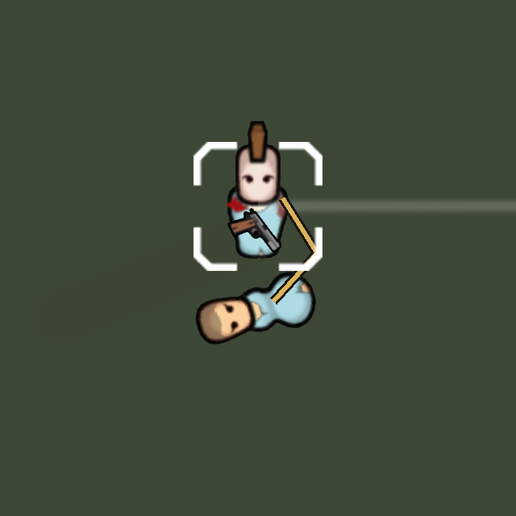

# TCCC 스킬 구현

원본 요구사항: `Docs/TCCCSkills.md`.

징집된 플레이어 소속 인간형 폰의 **TCCC 전술 응급처치** 메뉴에서 사용한다. 별도의 미구현 훈련 해금 조건은 없다. 조작 불가·쓰러짐·정신이상 상태에서는 사용하지 못한다.

| 스킬 | 구현 |
|---|---|
| 자가 지혈 | 1,800틱(30초) 작업. 1,200틱(20초)부터 출혈량 ×0.30, 완료하면 45,000틱(18시간) 동안 ×0.05. 중단 시 임시 압박 효과를 제거하며 완료 효과를 주지 않는다. 상처·혈액 손실 자체는 제거하지 않는다. |
| 부상자 이동 | 인접한 쓰러진 우호적 인간형 폰에 카라비너를 연결한다. 환자는 지도에 남아 구조자가 실제 통과한 칸을 따라간다. 손을 점유하지 않아 사격·다른 작업이 가능하다. 연결끈을 게임 렌더러로 그린다. 이동속도 ×0.65, 작업속도 ×2/3, 조준·공격 간격·지연형 작업 시간 증가. 연결 해제, 회복, 사망, 지도 이탈, 통과할 수 없는 경로에서 자동 해제한다. |
| 진통제 투여 | Blanca's Drugs의 `BD_Morphine`, `BD_Fentanyl`, `BD_Ketamine`, `BD_Laudanum`을 사용한다. 고통 10%를 목표로 약물 효과에 따라 필요한 정량 비율을 계산한다. 약물이 부족하면 남은 양만 사용한다. 실제 아이템 잔량을 보존하고 부분 약물은 정량 스택에 합쳐지지 않는다. |
| 지혈제 투여 | `HD_TCCC_HemostaticAgent` 1개를 180틱(3초) 동안 투여한다. 15,000틱(6시간) 동안 출혈량 ×0.30. 다른 TCCC 지혈 효과와는 강한 효과만 적용한다. 지혈제는 약품 연구대에서 일반 약품 1개로 2개 제작한다. |
| MIST 작성 | 300틱(5초) 동안 손상 기전·손상 부위·징후·처치 및 상태를 기록한다. 기록은 6시간 유효하며 건강 정보와 MEDEVAC 환자 선택창에서 확인한다. 선택 환자 전원의 기록이 유효하면 최초 헬기 접근 240→180틱, 준비된 환자의 탑승·인계 대기 60→30틱. 전진기지의 출혈 처치와 2시간 귀환 일정은 유지한다. |

## 진통제 연동

- 해당 모듈이 활성화됐을 때만 네 약물에 잔량 컴포넌트를 XML 패치로 추가한다. 동반 모듈의 원본 파일은 수정하지 않는다.
- 원래 약물의 섭취 처리를 실행하므로 고유 약물 효과, 화학 물질, 내성, 유전자 관련 처리는 해당 약물 및 게임 로직을 사용한다.
- 약물의 효과 심각도·내성 증가·기존 중독 심각도 증가·약물 욕구 충족·과다복용 수치는 투여 비율에 맞춰 줄인다. 부작용 능력치도 해당 비율로 조정한다.
- 신규 중독 판정에 전달하는 기본 확률은 **원래 확률 × 실제 투여 비율 × 0.5**이다. 게임의 추가 유전자·내성 조건은 그대로 적용된다.
- 기존 진통 효과가 적용 중일 때 TCCC로 중복 투여하지 않는다. 일반 섭취로 부분 약물을 사용해도 남은 비율만 적용된다.
- 약물 잔량, 효과와 MIST 기록, 부상자 연결 및 진행 중 치료 작업을 저장한다.

## 검증

`Source/Helodrace/Tactical/TcccInGameChecks.cs`는 `TCCC_TESTS`를 정의한 검증 빌드에만 포함된다. 일반 배포 DLL에는 테스트 코드와 테스트 자동 종료가 포함되지 않는다.

격리된 게임 실행 폴더와 저장 폴더는 `.codex-staging/TcccRuntime`이다. 게임 원본 데이터는 읽기용으로 연결하고, 기존 플레이 저장 및 모드 설정을 변경하지 않는다. 게임 실행 테스트는 실제 폰·작업·약물 섭취·사격·저장/불러오기·MEDEVAC을 사용한다. 결과는 `SaveData/tccc-results.txt`에 남긴다. 기본 모드의 기존 텍스처 중복 및 모듈형 무기 ID 관련 경고는 이 테스트의 수정 범위에 포함하지 않는다.

검증 빌드:

```powershell
dotnet build Source/Helodrace/Helodrace.csproj --no-restore -p:DefineConstants=TCCC_TESTS -p:OutputPath=../../.codex-staging/TcccRuntime/Mods/Main/Assemblies -p:IntermediateOutputPath=obj/TcccRuntime/ -v:q
```

배포용 빌드에서는 `DefineConstants=TCCC_TESTS`를 지정하지 않는다.

최종 검증 결과: [게임 내 테스트 기록](TCCCSkills_Validation.txt). 실제 약물 섭취에 전달된 중독 확률, 고통·투여량·원래 약물 효과, 일반 부분 복용, 지혈 단계, 연결 중 이동·사격·시간제 작업, 잔량과 연결의 저장/불러오기, MIST와 MEDEVAC의 전진기지 왕복 및 침대 인계를 모두 통과했다. 드래그 중 대기시간 계산은 전역 틱 나머지가 아닌 실제 작업 호출 횟수를 사용해 틱 간격 최적화로 작업이 정체되지 않도록 했다.

연결끈은 게임의 실제 폰·끈 렌더링을 별도 카메라에 출력하여 확인했다. 배치 모드의 데스크톱 캡처 대신 렌더 타깃을 사용했다.


