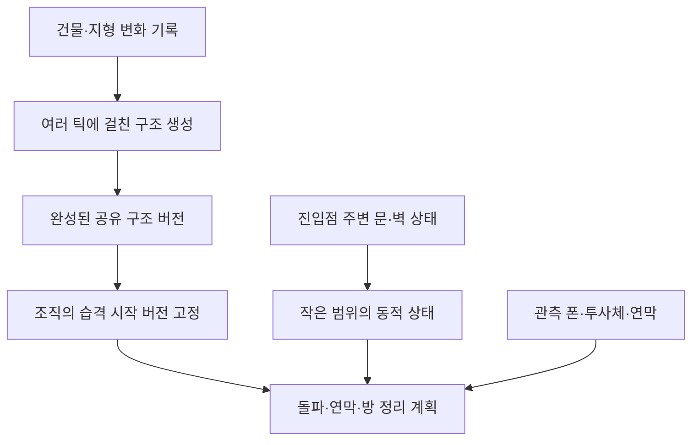

# 맵 캐시 구조와 분산 갱신 계획

2026-10-03 코드 기준. **이번 작업은 캐시 조사와 설계까지이며, 아래 분산 갱신 구조는 아직 구현하지 않았다.** 연막의 분대 공통 계획은 별도로 구현했다.

## 1. 현재 캐시는 하나의 맵이 아니다

| 층 | 소유자 / 자료형 | 수명 | 역할 |
| --- | --- | --- | --- |
| 맵 구조 분석 | `MapComponent_TacticalMapAnalysis` / `TacticalCellData[]` | 맵당 하나, 필요할 때 재생성 | 벽·문 주변의 형태와 경계 지점 점수 |
| 습격 시작 구조 | `RaidStructureSnapshot` / 셀 배열 + 방 번호 배열 + 건물 ID 배열 | 조직별로 습격 시작 때 고정, 저장 가능 | 원래 방 구획과 돌파 대상을 보존 |
| 이동 가능성 | `RaidNavigationSnapshot` / `bool[]`, `int[]` | 계획을 생성하는 동안 | 현재 열렸거나 해당 폰이 열 수 있는 문을 반영한 연결 영역 |
| 야전 위협 | `FieldThreatSnapshot` / 위협원 목록 + 셀 점수 사전 | 해당 계획 생성 동안 | 관측한 폰의 위치·무기 사거리로 계산한 위협 |
| 실제 이동 비용 | `RaidMovementArea` / `NativeArray<ushort>` | 처음 필요한 경로 요청에서 생성, 경로 계산기 종료까지 유지 | 바닐라 길찾기에 추가 비용과 통과 제한 제공 |
| 짧은 관측·실행 상태 | 실행기의 폰 목록, 대응 자리, 문 상태 서명 등 | 조직 실행 상태 또는 짧은 주기 | 저격·수류탄·문 개폐 등에 대한 실제 대응 |

위 층들은 갱신 시점과 의미가 다르다. 구조 분석 캐시가 존재하더라도 계획 생성의 연결 영역 검색과 새 이동 비용 배열 생성은 별도의 전체 맵 작업이다.

## 2. 맵 구조 배열에 들어 있는 정보

`TacticalCellData[] cells`는 모든 맵 셀을 포함하는 일차원 배열이다. 인덱스는 `map.cellIndices.CellToIndex(cell)`로 얻으며 현재 바닐라의 식은 `z × 맵 가로 크기 + x`다. 검색 지점마다 건물 목록을 다시 훑는 대신 해당 셀의 구조 정보를 읽는다.

| 필드 | 자료형 | 실제 의미 |
| --- | --- | --- |
| `Structures` | byte 기반 비트 플래그 | 문=1, 개구부=2, 코너=4, 복도=8, 교차 지점=16. 한 셀에 여러 특성이 붙을 수 있다. |
| `OpenDirections` | byte 기반 비트 플래그 | 북=1, 동=2, 남=4, 서=8의 잠재적 이동 방향. 인접 셀이 보행 가능하거나 문이면 해당 방향을 표시한다. **현재 문이 열렸다는 뜻은 아니다.** |
| `Standable` | bool | 분석 시점의 바닐라 `Standable` 결과. 해당 폰의 문 개방 권한이나 현재 예약 상태를 뜻하지 않는다. |
| `WallLine` | bool | 그 셀의 건물이 실제 벽 또는 문인지 |
| `Door` | `Building_Door` 참조 | 문 객체. 열림 여부 자체를 복사한 값은 아니다. |
| `ExteriorAccess` | bool | 문·개구부 양쪽의 실내외 또는 지붕 유무 차이로 추정한 외부 연결 여부 |
| `DoorThreat` | float | 문 셀 12, 문에 바로 인접한 셀 8, 나머지 0 |
| `WallThreat` | float | 양쪽이 막힌 통로 6, 코너 또는 교차 지점 4, 나머지 0 |
| `TotalThreat` | 계산 프로퍼티 | `DoorThreat + WallThreat`. 별도 저장 배열은 없다. |

추가로 `List<Building> breachStructures`에 벽과 문 객체를 모아 둔다. 캐시의 문·벽 점수는 문 주변을 경계할 이유를 나타내는 단순한 구조 점수이며, 실제 적의 화력이나 명중 확률을 저장한 값이 아니다. 킬존 감지와 전략적 중요도 정보는 없다.

형태 판정은 주로 인접한 네 셀을 본다. 양쪽이 막혔는지, 통로가 계속되는지, 두 방향의 벽이 만나고 두 방향 이상이 열렸는지 등을 조합한다. 이때 보조 함수 `IsWall`은 실제 벽 정의만 검사하지 않고, 문을 제외한 통행 불가 건물도 벽처럼 취급한다. `WallLine`의 정의와는 구분해야 한다.

**여기에 저장하지 않는 정보**: 폰 위치·사거리·조준 상태, 연막 밀도, 날아오는 수류탄, 현재 문 개폐 값, 폰별 문 개방 권한, 건물 현재 체력, 장비 소지 상태, 목적지 예약, 엄폐의 실제 사격 방향별 차단율, 전체 지형 이동 비용.

코드: [TacticalMapAnalysis.cs](../../Source/Helodrace/Core/TacticalMapAnalysis.cs).

## 3. 조직별 고정 방 구조

`RaidStructureSnapshot`은 조직이 처음 구조 정보를 요청할 때 만들어진다. 맵 분석 결과를 복사하고 그 시점의 바닐라 방 구획을 조직 전용 번호로 저장한다. 이후 벽이 파괴되어 바닐라 방이 합쳐져도 이 번호는 바꾸지 않는다.

| 저장소 | 형식 | 의미 |
| --- | --- | --- |
| `cells` | `TacticalCellData[]` | 위 구조 정보의 복사본 |
| `rooms` | `int[]` | 셀별 고정 방 번호. 1 이상은 당시 실내 방, 0은 외부 또는 방이 없는 셀. 0이 곧 보행 가능이라는 뜻은 아니다. |
| `structureIds` | `int[]` | 원래 벽·문의 `thingIDNumber`, 없는 셀은 0 |
| `breachCells` | `List<IntVec3>` | 원래 벽·문이 있던 셀 좌표 |
| `objectiveAnchors` | `List<IntVec3>` | 당시 플레이어 소유 실내 건물 중 벽·문을 제외한 건물 좌표. 다음 방 정리 후보 등에 사용하며 중요도 가중치는 저장하지 않는다. |
| `OrganizationId` | string | 이 스냅샷을 사용하는 조직 |

문이나 돌파 대상의 현재 객체가 필요하면 원래 셀에서 건물을 다시 확인하고 저장된 건물 ID와 비교한다. 파괴된 벽 자리의 새 벽을 원래 대상으로 오인하지 않는다. 따라서 **방 구획·외벽 형상은 고정되고, 원래 문·벽이 아직 존재하는지는 실시간**이다.

### 저장 파일 형식

맵 크기와 모든 셀을 바이너리로 기록하고 `Deflate` 압축 후 Base64 문자열로 저장한다. 문 객체 참조를 그대로 직렬화하지 않고 로드 후 셀과 ID로 복원한다.

셀 하나의 압축 전 기록은 다음 13바이트다.

| 항목 | 바이트 |
| --- | ---: |
| `Standable`, `WallLine`, `ExteriorAccess`를 묶은 플래그 | 1 |
| 구조 종류 플래그 | 1 |
| 열린 방향 플래그 | 1 |
| 문 점수 | 1 |
| 벽 점수 | 1 |
| 고정 방 번호 | 4 |
| 원래 건물 ID | 4 |

앞에 맵 가로·세로 각 4바이트가 있고, 셀 기록 뒤에는 앵커 수 4바이트와 앵커별 x/z 각 4바이트가 붙는다. 현재 고정 점수는 정수이므로 float 필드를 byte로 기록해도 손실이 없다. 향후 점수를 소수로 바꾸면 이 저장 형식도 수정해야 한다.

300×300 맵은 셀 기록만 조직당 1,170,000바이트다. 이는 압축 전 저장 크기다. 실행 메모리에는 참조·float·정렬 공간을 가진 구조 배열과 별도의 int 배열 두 개가 있으므로 셀당 13바이트보다 크다. 현재는 조직마다 전체 배열을 복사한다.

## 4. 현재 갱신 시점과 한 틱에 몰리는 작업

### 맵 구조 분석

- 최초 맵 컴포넌트 틱에서 전체 분석을 수행한다. `At()`으로 먼저 접근해도 생성할 수 있다.
- 최초 생성 또는 `RequestAnalysis()` 호출 때 건물 및 통행 불가 Thing의 ID·위치·Def와 개수로 구조 서명을 만든다. 서명이 달라졌으면 전체 분석을 다시 한다.
- 일반 틱마다 건물 변경을 검사하지는 않는다. 조직의 새 고정 구조 생성과 개발자 분석 요청 등이 변경 검사를 유발한다. 강제 재생성은 즉시 전체 분석이다.
- 분석은 전체 셀에 기본 정보를 쓰는 단계와 이웃 셀을 보고 형태를 만드는 단계가 같은 호출 안에서 실행된다.
- 문 개폐·체력 변화는 구조 서명에 없다. 지붕·지형 변화도 직접 포함하지 않는다. 따라서 현재 서명은 모든 구조 정보의 완전한 변경 감지가 아니다. 반대로 형태와 거의 무관한 다른 건물의 변경도 전체 재생성을 유발할 수 있다.

### 조직 스냅샷·계획

- 새 조직의 고정 구조 생성은 전체 셀 복사·방 번호 부여를 같은 호출에서 수행한다. 이후에는 계속 재사용한다.
- 조직 계획을 생성할 때 `RaidNavigationSnapshot`이 현재 보행 여부와 문 상태를 전체 셀에서 읽고, 사방 BFS로 연결 영역을 만든다. 이 작업도 여러 틱으로 나뉘지 않는다.
- 독립 조직의 일반 계획 생성은 같은 틱에 하나만 허용한다. 하지만 한 조직의 전체 분석·복사·연결 영역 생성 자체는 분산하지 않는다. 명시적 강제 계획 갱신은 이 제한을 우회한다.
- 실행 중인 유효한 공격 계획은 보존한다. 진행 계획이 없는 경우에는 서명 변화 또는 계획 나이 900틱 등에 따라 재계획할 수 있다. 조직 목록의 정기 계획 점검은 120틱 간격이다.
- 조직이 더 이상 맵에서 활동하지 않으면 계획·고정 구조 참조는 정기 점검에서 정리한다. 저장 시 스냅샷의 압축·기록은 별도의 동기 작업이다.

### 실제 길찾기 비용

`NativeArray<ushort>`는 셀당 2바이트다. 300×300 맵에서 배열 하나는 셀 데이터 기준 180,000바이트다. 최초 해당 이동 요청 때 배열을 전체 생성한다.

- 일반 접근: 기본 추가 비용 100. 계획 경로 주변 6칸, 담당 자리 주변 3칸 등은 0. 금지 구역은 `ushort.MaxValue`.
- 일반 교전: 조직·교전 중심·반경·방·활동 범위의 조합으로 별도 배열을 캐싱한다. 중심이 달라지면 다른 배열이 생길 수 있다.
- 위험 대응: 고정 구조 객체와 방 번호별로 공유한다. 같은 고정 방은 0, 다른 방은 `ushort.MaxValue`. 특정 경로로 복귀시키는 비용은 넣지 않는다.
- 네이티브 경로 작업이 배열을 참조할 수 있어 배열을 직접 수정하거나 즉시 해제하지 않는다. 현재는 바닐라 경로 계산기가 종료되고 진행 작업을 완료한 뒤 해제한다. 조직 참조가 지워져도 이동 캐시에 남은 배열이 즉시 해제되는 구조는 아니다.

코드: [RaidMovementArea.cs](../../Source/Helodrace/Core/RaidMovementArea.cs).

## 5. 현재 문·폰·위협은 어떻게 읽는가

`RaidNavigationSnapshot`에는 셀별 `bool walkable`과 연결 영역 `int components`가 들어간다. 문은 `door.Open`이거나 기준 폰이 `PawnCanOpen`할 수 있어야 이동 가능한 것으로 취급한다. 이 스냅샷은 해당 계획 생성에만 쓰이며 영구 저장하지 않는다.

`FieldThreatSnapshot`에는 관측 적의 **그 판단 시점 위치, 기본 무기 사거리·최소 사거리, 전투 능력 기반 강도**가 복사된다. 요청한 셀의 점수를 `Dictionary<IntVec3, float>`로 메모한다. 사거리 밖·최소 사거리 안·시선 차단 셀은 점수가 없고, 사거리 안에서 거리에 따라 강도를 낮춘다. 구조 배열에 모든 적의 위협을 미리 칠하는 방식은 아니다. 실행 중 저격 대응은 별도로 현재 `EffectiveRange`를 읽는다.

일반 공격 계획의 관측 적은 조직원이 40칸 이내에서 LOS로 확인한 살아 있고 다운되지 않은 적이다. 원거리 무기의 기본 강도는 `8 + 사격 레벨 × 0.7`, 근접은 `9 + 근접 레벨 × 0.5`다. 원거리 기준으로 셀 점수는 `강도 × Lerp(1, 0.42, 거리 / 사거리)`이며 여러 관측 적의 점수를 합한다. 원거리 판정이 되지 않으면 사거리 2.9칸을 사용한다. 이 값은 특정 계획의 판단용 점수로, 적이 움직인 뒤에도 영구 구조 정보처럼 유지하는 값은 아니다.

방 확보 단계에서는 목표 주변 12칸의 문을 대상으로 ID와 `Open`을 조합한 문자열 서명을 비교한다. 일반 실행 갱신인 30틱 주기에서 확인하고 변화하면 경계를 다시 배치한다. 다만 현재 구현은 가까운 문을 찾을 때 전체 Thing 목록을 필터링하므로, 데이터 범위는 작아도 조회 비용까지 완전히 지역화된 것은 아니다.

엄폐 선택·실제 보행·문 고장·수류탄·연막은 필요한 시점의 바닐라 상태를 읽는다. 저격 관측 폰 목록은 조직별 20틱 동안 공유하고 위험 대응은 10틱 간격이다. 이 짧은 목록은 폰 참조이며 영구 구조 배열과 다른 정보다.

코드: [RaidTacticalPlanner.cs](../../Source/Helodrace/Core/RaidTacticalPlanner.cs), [RaidTacticalExecution.cs](../../Source/Helodrace/Core/RaidTacticalExecution.cs), [RaidReactiveTactics.cs](../../Source/Helodrace/Core/RaidReactiveTactics.cs).

## 6. 수정안: 느린 구조·고정 계획·빠른 지역 상태를 분리

### 공유 구조 생성

맵 구조를 기본 셀 수집 → 형태 판정 → 방/영역 탐색 → 연결 지점 추출 → 완료본 공개로 나눈다. 각 단계는 처리 인덱스와 BFS 큐를 다음 틱으로 넘긴다. 큰 방 하나를 탐색할 때도 큐의 처리량을 제한해야 한다.

첫 적용안은 **틱당 약 1~2ms의 시간 예산과 셀 처리량 상한**을 함께 두고 측정 결과에 맞춰 조절하는 것이다. 이 수치는 목표 예산이며 현재 성능 측정값은 아니다. 모든 조직이 같은 맵 작업 스케줄러의 예산을 공유한다. 별도 스레드에서 바닐라 Map/Room/Thing API를 직접 호출하지 않고 메인 스레드에서 작업을 잘게 나눈다.

기존 완료본과 생성 중 버퍼를 분리한다. 생성 중인 절반의 맵을 계획기에 노출하지 않는다. 완료본이 없으면 외부 집결·대기 상태를 사용하고, 존재하면 새 버전이 완성될 때까지 기존 완료본을 쓴다. 분산 생성 중 구조 변화는 변경 셀/건물 목록으로 수집해 작업 결과의 일관성을 확인한다. 계속 변화한다고 매번 처음부터 재시작하는 방식은 피한다.

### 조직은 구조 버전을 참조

같은 물리 구조를 조직마다 전체 복사하는 대신 완성된 불변 구조 버전을 참조한다. 조직별로는 선택한 진입점·목표·정리한 방·관측 정보 등만 가진다. 진행 중인 조직은 시작 버전을 유지한다. 다른 조직이나 대기 중인 새 계획은 새 완료 버전을 사용할 수 있다.

벽 파괴 때문에 실제 방이 합쳐져도 진행 조직의 방 번호를 다시 부여하지 않는다. 현재 열린 돌파 구멍을 기존 방 사이의 통과 지점으로 해석한다. 구조 버전 갱신이 진행 중인 대열·진입 순서·방 정리 순서를 자동으로 바꾸지 않게 한다.

### 진입점 주변의 동적 상태

선택한 진입점과 현재 방 주변의 작은 범위에 대해서만 다음 정보를 따로 관리한다.

- 문 ID·셀, 열림, 고장으로 열린 상태 고정, 파괴/제거 여부.
- 벽과 개구부의 현재 존재·실제 통행 상태.
- 해당 조직/폰이 문을 열 수 있는지. 권한은 전역적인 열림 값과 구분한다.
- 상태가 바뀐 시점과 변경 버전.

문 열림·닫힘, 돌파·파괴·수리 알림을 우선 반영하고, 기본 30틱 정도의 지역 재확인으로 누락이나 다른 모드의 변경을 보완한다. 전체 Thing 목록 대신 지역 셀/문 목록을 조회한다. 변화가 없으면 아무 명령도 갱신하지 않는다. 변화가 생겨도 해당 문/진입 명령만 갱신하고 전체 방 분석을 다시 하지 않는다.

### 이동·위협 정보

현재 전체 맵 `RaidNavigationSnapshot`은 구조 버전의 방/영역 그래프와 지역 문 연결 상태를 조합하는 방향으로 바꾼다. 최종 보행은 바닐라 길찾기에 맡기고, 필요할 때 해당 진입점 근처만 세밀하게 검증한다. 구조가 바뀌지 않았는데 폰별로 전체 연결 영역을 다시 만드는 작업을 줄인다.

폰 위치·무기 사거리·연막·수류탄은 구조 버전의 일부로 고정하지 않는다. 관측한 정보만 짧은 수명으로 처리한다. 사격 방향에 따른 실제 엄폐와 LOS도 판단·행동 시점의 지역 검증으로 남긴다.

경로 비용 배열은 만들 때 분산 처리하고 완료 배열만 바닐라에 넘기는 방법을 검토한다. 네이티브 인터페이스가 요구하는 배열은 전체 셀 배열이므로 청크 캐시만으로 자동 해결되지는 않는다. 진행 중 경로 요청의 배열 참조 수명을 먼저 확인해야 하며, 공유 구조 버전을 교체했다고 사용 중인 네이티브 배열을 해제해서는 안 된다.

## 7. 구현 순서와 확인 기준

1. 구조 분석·조직 복사·연결 영역·이동 비용 배열의 개별 시간/셀 수/메모리 통계를 추가한다. 어느 작업이 실제 프레임 지연을 만드는지 분리한다.
2. 맵 구조 분석을 단계별 생성과 완료본 공개 방식으로 바꾼다. 큰 외부 영역과 큰 방의 BFS도 틱 예산을 지켜야 한다.
3. 조직의 전체 셀 복사를 공유 불변 버전 참조로 교체한다. 저장 파일도 공유 버전은 한 번, 조직은 버전 식별자와 실행 상태만 기록한다.
4. 지역 문/돌파 상태를 분리한다. 문 개폐 반복·해머 고장·수리·벽 파괴가 해당 진입에 반영되되 고정 방 번호는 유지되어야 한다.
5. 계획 생성의 전체 이동 가능성 검색과 네이티브 비용 배열의 생성·재사용·해제를 개선한다. 안전한 경로 작업 수명 추적이 선행되어야 한다.

검증할 상황: 큰 맵의 최초 생성, 여러 조직 동시 습격, 캐시 생성 중 건설/철거, 같은 문 반복 개폐, 기존 벽 파괴 후 같은 자리 재건축, 큰 방 합쳐짐, 캐시 생성 중 저장·로드, 네이티브 경로 계산 중 버전 교체, 맵 제거. 평균 시간뿐 아니라 최대 한 틱 시간과 보존된 구조 버전·배열 수를 기록한다.

## 8. 이번 연막 변경과의 관계

연막은 분대 밀집 구간의 대표 위치와 공통 접근 경로로 **집결 영역·연막 목표·투척 자리**를 먼저 고정한다. 이후 투척자를 선정한다. 뒤의 투척자가 이동해도 목표점을 그 폰 앞쪽으로 다시 만들지 않는다. 대원은 연결된 공통 집결 영역의 자리를 공유하고, 본대의 80%가 집결점 6칸 안으로 모이면 투척을 시작한다. 투척자 사망·교체 시에도 같은 계획 지점을 사용한다. 집결·투척자 접근 대기에는 720틱 제한을 두며, 실제 투척 작업과 연막 효과는 별도의 기존 완료 조건을 따른다.

이 연막 계획은 조직의 실행 상태에 저장한다. 맵 구조 캐시를 변경하거나 전체 맵 비용 배열을 연막 목표마다 새로 만드는 방식은 아니다.

코드: [RaidSmokeFormation.cs](../../Source/Helodrace/Core/RaidSmokeFormation.cs), [RaidSmokePlanning.cs](../../Source/Helodrace/Core/RaidSmokePlanning.cs), [RaidApproachSmoke.cs](../../Source/Helodrace/Core/RaidApproachSmoke.cs).
