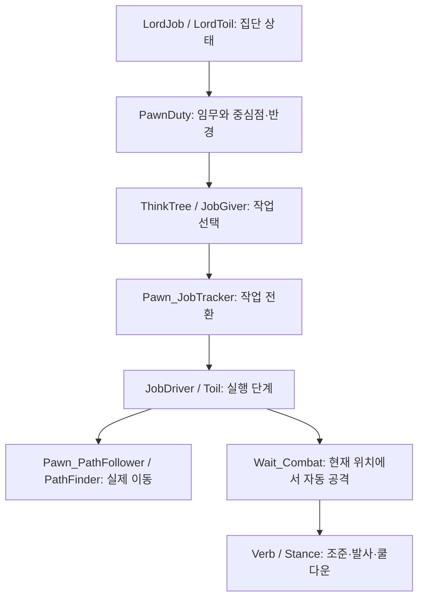

# 바닐라 전투 구조와 전술 AI 개선안

작성 기준: 2026-10-03, 설계 당시 `main` (`fc605766`)의 공격 실행 코드와 설치된 RimWorld 원본 `Assembly-CSharp.dll` 분석.

후속 구현 상태와 검증 결과는 [전술 AI 개선 진행상황](전술%20AI%20개선%20진행상황.md)을 확인한다. 아래의 현재 상태·미구현 설명은 설계 당시 기준이다.

이 문서는 공격 과정에서 보고된 문제, 현재 들어간 보완, 바닐라 기능을 활용한 후속 설계를 정리한다. **아래 개선안은 설계 제안이며 이번 문서 작성으로 게임 코드가 변경된 것은 아니다.** 소스에서 확인한 사실과 게임 실행으로 확인해야 할 가설을 구분한다.

관련 문서:

- [전술수립 시스템](전술수립%20시스템.md): 장기 목표.
- [기존 전략 시스템 수정 방향](기존%20전략%20시스템%20수정%20방향.md): 정적 구조 캐시의 책임 범위.
- [습격 이동·진입 검토 기록](../TacticalRaidReview.md): 초기 문제와 당시 수정 기록. 경유지 강제 이동 등 과거 설명은 현재 구현과 다를 수 있다.
- [전술 맵 분석](../TacticalMapAnalysis.md): 기존 맵 설명. 최종 목표와 계획 갱신 등 일부 설명은 현재 코드보다 오래되었으므로 이 문서의 현재 상태 및 실제 소스를 우선한다.

## 1. 유지할 방향

- 구조 분석은 문·벽·코너·개구부·방 연결 정보를 중심으로 단순하게 유지한다. 별도 킬존 감지 맵과 전략적 가치 맵을 다시 추가하지 않는다.
- 습격 시작 구조 스냅샷을 방 돌파 순서의 기준으로 사용한다. 문이 열리거나 벽이 파괴되었다고 진행 중인 계획 전체를 다시 만들지 않는다.
- 실제 보행 가능 여부, 문 상태, 공격 가능 여부는 실행 시점의 맵에서 검사한다. 오래된 구조 캐시를 실제 이동 가능성의 보증으로 사용하지 않는다.
- 야전의 적 위치·사거리·LOS는 판단 시점에 가져온다. 이를 맵의 영구 위험 점수로 저장하지 않는다.
- 현재 요구대로 소유자의 이름이 있는 침대를 최종 목표로 유지한다. 이는 사용자가 지정한 목표 규칙이며, 다른 시설을 가치별로 평가하는 전략 맵을 뜻하지 않는다.
- 외벽 돌파는 공통 돌파 지점과 외부 접근을 먼저 정한다. 열린 입구가 있다는 이유만으로 그곳까지 우회해 걸어 들어가지 않는다.
- 야전 이동에는 목표점과 넓은 활동 영역을 제공한다. 스택업 및 개구부 통과처럼 협동이 필요한 단계만 위치·순서를 엄격히 관리한다.

## 2. 현재 공격 과정의 문제와 상태

최근 코드 보완은 회귀 방지를 위한 기반이다. 실제 게임에서 보고된 현상이 모두 해소되었다는 의미는 아니다.

| 보고된 문제 | 소스에서 확인한 구조 또는 원인 후보 | 현재 보완 | 남은 확인·개선 |
|---|---|---|---|
| 목표까지 이동할 때 흩어짐 | 폰별 `Goto`는 각자의 경로를 계산한다. 공통 목표만으로 동일 통로·대형이 보장되지 않는다. | 공통 접근 및 배치 계획이 존재한다. | 공통 이동 영역과 단계별 도착 조건을 제공하고, 실제 경로가 영역을 벗어나는 이유를 기록한다. |
| 외벽 대신 열린 통로로 우회 | 일반 보행 탐색은 도달 가능한 통로를 고른다. 외벽을 부술 목표 선정과 외부 작업 위치 이동이 별도로 필요하다. | 계획된 돌파 대상, 외부 작업 셀, 내부 통과 셀을 사용한다. | 실행 경로가 다른 입구를 거쳐 내부로 들어가지 않는지 검사한다. 돌파 수단 보유만으로 경로가 바뀌지는 않는다. |
| 집결·스택업 중 왕복 | 배치 변경, 계획 교체, 작업 종료 후 기존 습격 AI 재개, 실패한 이동 재발행이 후보다. | 활성 계획 유지, 같은 목적지 `Goto` 재발행 생략, 도착 후 긴 전투 대기. | 작업 소유권과 재계획 조건을 명시하고, 작업 전환을 추적해 실제 원인을 분리한다. |
| 스택업 탐색 때 버벅임 | 다수 후보에 대한 도달 검사·LOS·방 탐색과 여러 조직의 동시 계획 생성이 비용을 만든다. | 구조 캐시, 후보 압축, 싼 기하 평가 후 도달 검사, 활성 계획 재사용. | 틱별 계획 시간·후보 수·도달 검사 수를 측정한다. 예산 초과 시 여러 틱에 나눠 처리한다. |
| 개구부 안에서 전진·후퇴 반복 | 개구부 양쪽의 목표 교체, 집결 복귀, 통과 중 전투 AI 복귀, 좁은 칸에서 충돌이 후보다. | 폰별 단방향 통과 진행 상태와 현재 통과자, 개별 내부 도착 위치. | 통과한 폰을 외부 배치로 회수하지 않는지, 내부 대기 폰이 다음 통과자를 막지 않는지 게임에서 확인한다. |
| 구불구불한 지형에서 후미가 벽에 비빔 | 직선 거리로 대열 간격을 유지하면 벽 너머의 아군에게 붙으려 할 수 있다. | 이전 왕복 및 접근 보완이 있으나 모든 지형에서 확인되지는 않았다. | 거리만으로 복귀시키지 않고 같은 접근 영역·연결성을 확인한다. 후미를 기다릴 넓은 지점을 사용한다. |
| 바위 등 때문에 대형 구성 불가 | 돌파 가능성과 스택업 가능성은 별개다. | 안전한 스택 후보와 계획된 작업 위치를 선정한다. | 필요한 인원이 배치되고 작업자·투척자 동선까지 확보되는 돌파 후보만 채택한다. |
| 개구부 확보 후 중간 행동이 생략됨 | 지원 수단의 사용 가능성, 투척 위치, 시간 제한, 실패 후 다음 단계 전환을 따로 확인해야 한다. | `Support`, `EntryWait` 및 투척·외부 지원 분기 존재. | 지원 생략 사유와 실제 착탄·폭발 완료 여부를 표시한다. 보유했다고 무조건 사용 완료로 처리하지 않는다. |
| 공격 중 다수 오류 | 로그의 예약 경고, 저장·정의 오류, 전술 런타임 예외는 원인이 다를 수 있다. | 슬래지해머 작업의 예약 인원 설정 보완. | 새 로그의 최초 예외와 전체 호출 스택으로 분류한다. 모든 오류를 스택업 하나의 원인으로 단정하지 않는다. |
| 흩어진 진입 방식에서 전술 미시작 | 조직 등록·Lord 배정·계획 실패 시점이 영향을 줄 수 있다. | 실제 공격 Lord 계열 및 공병·브리칭 상태를 인정하고 공병 호위 fallback 유지. | 흩어진 진입 후 미합류 인원, 공격 전 대기 상태에서의 실행 시작을 확인한다. |

현재 핵심 코드: [RaidTacticalExecution.cs](../../Source/Helodrace/Core/RaidTacticalExecution.cs), [RaidTacticalPlanner.cs](../../Source/Helodrace/Core/RaidTacticalPlanner.cs), [RaidBreachTraversal.cs](../../Source/Helodrace/Core/RaidBreachTraversal.cs).

## 3. 바닐라 전투 코드의 책임 분리



### 집단 지휘와 작업 선택

`LordJob`과 `LordToil`은 집단의 공격·수비·돌파 상태를 관리하고 `PawnDuty`를 배정한다. `focus`, `radius`는 임무 중심과 활동 범위이며, 정확한 이동 목적지는 실제 작업의 `targetA` 등으로 지정한다.

`ThinkNode_Duty`는 해당 임무의 행동 트리를 실행한다. `ThinkNode_Priority`는 위에서부터 실행 가능한 작업을 찾고 첫 작업을 채택한다. 일반 `AssaultColony`는 전투, 건물 공격, 가까운 적에게 이동 등의 분기를 가지며, 공통 대형이나 통과 순서를 제공하지 않는다.

`Pawn_JobTracker`는 일반 행동 트리뿐 아니라 상시 행동 트리도 처리한다. 상시 판단은 30틱 간격으로 검사하며 폭발 회피 등 긴급 작업이 현재 작업을 중단할 수 있다. 일반 전투 행동 트리가 매 30틱마다 무조건 엄폐 이동을 덮어쓰는 것은 아니다.

### 표적과 사격 위치

`JobGiver_AIFightEnemy`는 표적을 선택·유지한 뒤 현재 위치의 엄폐, 사격 가능성, 목적지 예약을 검사한다. 현재 위치가 적절하거나 적이 매우 가까우면 `Wait_Combat`을 선택한다. 이동이 필요하면 `CastPositionFinder`로 사격 위치를 고르고 `Goto`를 발행한다. 일반 원거리 전투 작업에는 450~550틱의 재판단 간격을 설정한다.

`AttackTargetFinder`는 사격 가능한 표적에 거리, 최근 공격한 표적, 상대 엄폐, 아군 오인사격 관련 조건 등을 반영한다. 일부 표적 선택은 점수에 따른 가중 무작위 선택이다. 분대 전체의 동일 표적 집중이나 분담을 자동으로 보장하지 않는다.

`CastPositionFinder`는 이동 가능성, 도달 가능성, 실제 사격선, 무기 사거리, 목적지 예약, 특정 적을 상대로 한 엄폐, 이동 거리 등을 평가한다. 요청의 `validator`, `preferredCastPosition`, `maxRangeFromCaster`, `locus`, `maxRangeFromLocus` 등으로 후보를 제한할 수 있다. 구조를 바탕으로 후보를 좁히고 원본의 사격 가능 판정을 재사용할 수 있다.

`JobGiver_AIDefendPoint`는 duty의 중심과 반경을 사격 위치 요청에 전달한다. 다만 바닐라 `Defend` 임무에는 전투 외에 필요 충족과 주변 배회도 포함된다. 고정 스택업을 위해 이 임무 전체를 그대로 사용하면 안 된다.

원본 사용 시 유의점: 현재 분석한 `CastPositionFinder`는 locus 반경의 검색 사각형을 줄일 때 `locus` 대신 `targetLoc`을 기준으로 하는 코드가 있다. 최종 후보 검사에서는 locus 거리를 확인하지만, 중심점과 적이 멀리 떨어지면 유효 후보가 누락될 수 있다. 활동 영역 제한을 구현할 때는 이 동작과 현재 위치 유지의 우선 분기까지 검증해야 하며, `maxRangeFromLocus` 하나만으로 모든 제약이 보장된다고 가정하지 않는다.

### 엄폐와 사격선

`CoverUtility`는 위치 주변 8칸의 엄폐물과 공격자 방향을 비교해 차단 확률을 계산한다. 벽에 붙어 있다는 사실만으로 안전해지지 않는다. 적 방향, 물체의 엄폐 성능, 거리 등이 영향을 준다. 사격 가능한지는 `Verb`의 사격선 검사와 모서리에서 몸을 내미는 판정 등을 추가로 거친다.

이 값은 특정 적 방향에 대한 엄폐 효과다. 모든 적의 교차 사격이나 수류탄 폭발에 대한 안전성을 뜻하지 않는다. 스택업 안전은 별도의 투척 위치 LOS·폭발 범위·진입 동선 검사와 결합해야 한다.

### 정지 사격과 방향

`JobDriver_Wait`는 전투 대기 시작 시 이동을 멈추고 현재 셀을 예약한다. `Wait_Combat`에서는 현재 위치에서 표적을 찾아 자동 사격하고 인접 적에게 근접 공격한다. 엄폐를 찾아 이동하는 기능은 없다.

`Pawn.TryStartAttack → Verb.TryStartCastOn → Stance_Warmup → 발사·연사 → Stance_Cooldown`이 실제 공격 흐름이다. 일반 `Goto`를 주었다고 이동하면서 자동 사격하는 기능이 생기는 것은 아니다.

대기 작업에는 `job.overrideFacing`에 따른 방향 유지 기능이 있다. 이를 사용하면 작업이 방향 제어를 맡지만 사격 표적을 향하는 회전과 정책을 조정해야 한다. 현재 모드의 직접 `pawn.Rotation` 변경은 원본 회전 갱신 및 모드의 전술 조준 패치와 함께 검토한다. 평상시 경계 방향과 실제 교전 중 방향의 우선순위를 명시한다.

### 이동과 예약

`Goto → JobDriver_Goto → Toils_Goto → Pawn_PathFollower.StartPath`가 실제 이동으로 이어진다. 현재 설치 버전의 `PathFinder`는 요청을 모아 Unity Job에서 A* 계열 탐색을 수행한다. 지형·문·장애물·적용되는 회피 그리드·집단 이동 영역 밖 비용 등을 반영한다.

`Pawn_PathFollower`는 앞쪽 경로의 장애물, 폰 충돌, 문 상태, 목적지 변화 등을 확인하고 필요할 때 재탐색한다. 원본도 같은 목적지의 진행 중인 경로를 유지하는 분기가 있다.

`PawnDestinationReservationManager`는 목적지 중복을 피하기 위한 체계다. 통로 전체를 예약하거나 여러 폰의 통과 순서를 보장하는 체계가 아니다. 또한 직접 `Goto`를 시작하기 전에 다른 폰과의 목적지 충돌을 검사하는 책임도 호출자에게 있다. 작업용 `ReservationManager`와 목적지 예약을 구분한다.

### 바닐라 브리치

`LordToil_AssaultColonyBreaching`은 공통 목표와 돌파 담당·호위 임무를 배정한다. `BreachingGrid.CreateBreachPath`는 파괴 가능한 구조를 포함해 경로를 찾고, 이를 넓혀 돌파 영역과 이동 영역을 만든다. 이동 영역 밖에는 추가 비용을 준다. `JobGiver_AIBreaching`은 공통 돌파 대상과 개별 공격 위치를 사용한다.

재사용할 핵심은 **공통 목표 + 넓은 이동 영역 + 개별 작업 실행**이다. 바닐라의 위험한 방 비용이나 노이즈 평가까지 모두 도입할 필요는 없다. 이 모드의 단순 구조 분석 및 외벽 직선 돌파 방침에 맞춰 필요한 개념만 사용한다.

## 4. 공격 실행 개선안

### 4.1 작업을 발행하는 주체를 하나로 만든다

현재 실행기는 30틱마다 상황을 확인하고 필요한 경우 `StartJob(...InterruptForced)`로 작업을 준다. 같은 `Goto` 목적지는 생략하지만 작업 종류·목적지가 바뀌면 기존 작업을 정리한다. `StartJob`의 기본값은 바쁜 자세도 취소하므로, 잦은 명령 변경은 조준·쿨다운·예약·경로를 흔들 수 있다.

제안:

1. 집단 실행기는 단계, 목표, 배치, 통과 순서만 관리한다.
2. 전용 `DutyDef`와 `JobGiver`가 현재 단계에서 필요한 작업을 선택한다. 바닐라 공격 임무가 같은 폰에게 별도 목표를 주는 통로를 정리한다.
3. 같은 작업·목적지·계획 세대이면 현재 작업을 계속한다. 긴급 위험, 작업 불가능, 단계 전환 때만 교체한다.
4. 폭발 회피 등 필요한 긴급 행동은 허용한다. 복귀 시 전체 계획을 초기화하지 않고 중단 전 진행 상태를 이어간다.
5. 조준·연사·투척·해머 작업 중에 불필요한 위치 보정 명령을 내리지 않는다. 자세 취소 여부는 작업별로 정한다. 모든 전환에 `cancelBusyStances=false`를 일괄 적용하는 방식도 피한다.

집단 상태 갱신의 30틱 주기 자체보다, 그 주기에 어떤 작업이 얼마나 자주 교체되는지가 우선 점검 대상이다.

### 4.2 계획을 고정하되 불가능한 부분만 복구한다

단계 시작 시 돌파 대상, 스택업 배치, 투척 계획, 통과 순서를 확정한다. 인원 사망은 해당 배치 제거·작업자 승계로 처리하고 진행 중인 전원을 재배치하지 않는다. 새 인원은 통로 밖의 합류 위치에 배정한다.

재계획은 다음과 같이 구분한다.

| 변화 | 처리 |
|---|---|
| 문 열림·벽 파괴 | 기존 계획의 개구부 확보 여부만 갱신 |
| 경계 인원 사망 | 해당 감시 방향을 남은 인원에게 재배정 |
| 돌파 담당자 전투불능 | 기존 작업 위치·대상을 유지하고 담당자 승계 |
| 한 스택 셀 차단 | 해당 폰의 대체 셀만 한 번 선택 |
| 모든 접근 셀 차단·돌파 수단 상실 | 명시적 실패 상태에서 지역 계획 또는 단계 변경 |
| 근처 적 이동 | 단기 교전 판단 갱신, 방 구조·최종 목표 유지 |

현재 실행 단계·통과 상태는 저장하지만 `ActivePlan`은 계획 캐시로 재생성한다. 저장 후 로드에서는 확정 배치와 진행 상태가 같은 계획에 속하는지 확인해야 한다. 후속 설계는 확정된 최소 계획 데이터를 저장하거나 동일하게 복원한 뒤 작업을 발행한다. 로드 후 원본 임무가 먼저 움직이는 구간도 검증한다.

### 4.3 접근은 목표점과 활동 영역을 사용한다

외부 접근 목표와 넓은 공통 통로를 선정하고 원본 경로 탐색기에 이동을 맡긴다. 영역 밖은 비용을 높여 선호를 낮춘다. 조금 옆으로 움직였다는 이유로 즉시 복귀시키지 않는다. 지속적 이탈·진행 정체 때만 목표를 조정한다.

다만 비용은 선호이며 출입 금지 보장은 아니다. 다른 입구로 내부를 우회하는 것이 허용되지 않는 외벽 접근에서는 현재 외부 영역의 연결성을 검사하고, 필요하면 전용 경로 제약 또는 외부 중간 목표를 사용한다. 바닐라 `LordWalkGrid`는 집단 단위이므로 진입조·지원조에 서로 다른 영역을 줄 경우 하위 집단 또는 별도 경로 비용 제공 구조를 검토한다.

후미와 선두의 직선 거리만으로 대열을 제어하지 않는다. 같은 접근 구간인지, 통로를 따라 도달 가능한지, 최근에 진행했는지를 함께 보고 다음 넓은 지점에서 기다린다. 공간이 부족하면 허용 간격을 늘리고 인접 아군에게 끊임없이 붙는 명령을 내리지 않는다.

### 4.4 스택업은 전용 정지 작업으로 유지한다

- 개구부 옆 벽에 붙은 실제 보행 가능 셀을 선택한다. 작업자와 투척자의 동선 및 통과 셀을 비워 둔다.
- 도착 후 위치 재탐색 없이 정지한다. 평상시에는 배정된 경계 방향을 보고, 실제 공격 시 표적 방향을 우선한다.
- `Wait_Combat`의 정지·공격 구조를 재사용하되 진입 순서와 경계 방향은 전용 임무 또는 작업에서 관리한다.
- 투척자는 별도 위치를 사용한다. 나머지 인원은 예상 투척·폭발 지점의 LOS와 폭발 범위에서 제외한다. LOS 차폐만으로 안전을 확정하지 않고 탄종·폭발 방식 및 아군 위치를 검사한다.
- 안전한 대형을 만들 수 없는 후보는 다른 벽면·문으로 변경한다. 도착 시간 제한만으로 준비 완료를 선언하지 않는다.

### 4.5 돌파·지원·통과를 명확한 완료 조건으로 잇는다

```text
외부 접근 → 스택업 → 돌파 작업 → 실제 개구부 확인
→ 지원 사용 또는 생략 사유 확정 → 착탄·폭발·연막 준비 확인
→ 순서에 따른 개구부 통과 → 내부 분산 → 방 확보
```

슬래지해머는 일반 적대 문을 우선 후보로 삼는다. 보안문은 기존 제한을 유지하고 벽은 가능한 대열·작업 공간을 갖춘 경우 지속 파괴한다. 도구 작업의 성공과 실제 통로가 열렸는지는 별도로 확인한다.

개구부는 현재 통과자를 지정하고 이전 통과자가 내부 통로를 비운 뒤 다음 인원을 허용한다. 통과 완료한 폰은 외부 스택업으로 돌아가지 않는다. 내부 도착점은 문턱을 벗어난 서로 다른 셀로 정하고 점유·예약·도달 여부를 확인한다. 쓰러진 폰이나 잔해가 막으면 대기·제거·다른 개구부 선정 중 하나의 복구 상태로 들어간다.

최종 목표 방 확보 후에는 초기 방 연결 정보를 따라 미확보 인접 방을 선택한다. 문 상태는 실시간 검사하고, 처리한 방의 식별은 벽 파괴로 방이 합쳐져도 되돌리지 않는다. 캐시의 내부 공간 구분과 현재 실제 방 판정을 혼동하지 않는다.

## 5. 야전 모드 활용

현재 `DirectAssault`, `FlankAttack`, `SmokeAdvance`, `FieldGrenade` 등의 선택 및 지원 실행 분기가 있다. 그러나 공통 실행 대상은 공격 중인 습격 폰이며, 독립된 야전 지휘 수명주기가 완성된 것으로 보지는 않는다.

야전에서는 고정 스택업보다 **분대 중심점 + 넓은 교전 영역 + 개별 엄폐 선택**이 적합하다.

| 재사용 요소 | 활용 방식 | 제한 |
|---|---|---|
| 정적 구조 캐시 | 벽·코너·통로를 접근·경계 후보로 사용 | 적 존재나 실제 사격 위험으로 간주하지 않음 |
| 판단 시점 적 스냅샷 | 위치·사거리·최소 사거리·LOS로 접근 후보 평가 | 영구 맵에 쓰지 않으며 관측 정책을 별도로 적용 |
| `CastPositionFinder` | 교전 영역 안에서 엄폐와 사격선을 갖춘 위치 선택 | 후보 수·검색 범위를 제한하고 기존 위치를 우선 유지 |
| `Wait_Combat` 및 `Verb` | 자리 잡은 인원의 사격·조준·쿨다운 | 이동 중 사격은 별도 기능과 통합해야 함 |
| 공통 이동 영역 | 기동조가 같은 방향으로 접근하도록 유도 | 위험한 영역 통과가 금지되어야 하면 비용 외의 제약 필요 |
| 기존 지원 분기 | 엄호 사격, 연막, 야전 수류탄, 외부 지원 | 아군 동선·실제 투척 가능성·효과 준비 확인 |

제안 행동 흐름은 `접근 → 접촉 → 화력조 정지 → 기동조 이동 → 재집결/계속 공격`이다. 양쪽을 동시에 계속 전진시키지 않고 정지한 화력조가 있는 동안 기동조만 다음 중심점으로 이동한다. 효과가 작은 엄폐 개선을 위해 사격 위치를 계속 바꾸지 않는다. 새로운 자리가 충분히 유리하고 이동 위험을 감수할 가치가 있을 때만 변경한다.

현재 `FieldThreatSnapshot`에는 적대 폰 목록이 전달되며, 모든 위협원이 관측된 적으로 제한되지는 않는다. 이는 현재 구현의 사실이다. 후속 설계에서 전지적 판단을 줄이려면 분대가 현재 관측한 적과 짧게 유지하는 마지막 관측 정보만 입력하고, 미관측 적의 현재 위치를 자동 갱신하지 않는 정책이 필요하다. 이름 있는 침대 목표 규칙과 적 실시간 관측 정책은 별개로 취급한다.

구조 점수, 관측 적에 대한 노출 점수, 실제 엄폐 효과를 하나의 정밀 위험 확률처럼 표시하지 않는다. 계획 후보를 비교하는 근거로 각각 보여 준다.

## 6. 수비 모드 활용

현재 피해 비율 또는 가까운 적·위험 조건으로 `HoldAndCounterattack`을 선택하고, 저격조·동행 인원·대응조를 배정하는 코드와 `Hold` 실행이 있다. 이는 공격 조직이 수비로 전환하는 기능이다. 일반 수비 Lord나 비공격 조직까지 같은 기능을 사용하는 독립 모드는 아직 별도 연결이 필요하다.

독립 수비 모드의 제안 상태는 `수비 위치 배정 → 경계 → 제한 대응 → 원위치 복귀 → 재편성`이다.

- 수비 중심, 담당 접근축, 활동 반경을 duty로 제공한다. `JobGiver_AIDefendPoint`의 개념과 원본 엄폐·사격 판정을 재사용한다.
- 전투가 없을 때도 자리를 유지해야 하는 인원은 전용 정지 분기를 사용한다. 바닐라 `Defend`의 배회·일상 작업 분기를 그대로 도입하지 않는다.
- 저격조는 사격선과 사거리, 화력지원조는 주요 접근축, 대응조는 가까운 침입 방향을 담당한다. 한 사람이 독립된 여러 출현 지점을 전부 맡지 않도록 배분한다.
- 대응조는 관측된 위협과 정해진 추격 한계 안에서만 이동한다. 목표 소멸·시야 상실·영역 이탈 시 원래 수비 중심으로 복귀한다.
- 사주경계 담당자가 자리를 비우면 해당 방향만 재배정한다. 적이 잠깐 이동할 때마다 전체 방어선을 회전시키지 않는다.
- 공격으로 복귀할 때는 새로운 공격 단계와 계획 세대를 명시한다. 기존 수비 위치·반격 목적지·개구부 통과 상태를 함께 사용하지 않는다.

| 모드 | 위치 제어 | 표적 선택 | 재계획 계기 |
|---|---|---|---|
| 공격 접근 | 외부 목표점과 공통 이동 영역 | 필요한 접촉 대응 | 경로·작업 불가능, 명시적 단계 전환 |
| 스택업 | 확정 셀 고정 | 현재 위치에서 공격·경계 | 셀 차단, 담당자 상실, 긴급 위험 |
| 개구부 통과 | 순서와 단방향 진행 엄격 유지 | 통과를 막는 즉각적 위협 우선 | 개구부 차단, 통과자 정체 |
| 야전 교전 | 중심점 주변 개별 엄폐 허용 | 관측된 적과 원본 공격 판정 | 교전 상황의 의미 있는 변화 |
| 수비 경계 | 담당 접근축 주변 제한 이동 | 활동 영역 안에서 대응 | 담당 방향 상실, 위협 방향 변화 |
| 수비 대응조 | 제한된 기동 후 복귀 | 지정된 관측 위협 | 목표 상실, 추격 한계 도달 |

## 7. 캐시·성능·디버그 구조

| 데이터 | 유지 기간 | 갱신 기준 |
|---|---|---|
| 맵 구조 특징 캐시 | 맵 수명 또는 명시적 재생성까지 | 실시간 문 개폐로 갱신하지 않음 |
| 조직별 방 구조 스냅샷 | 해당 습격의 수명 | 처음 전술 준비 때 생성, 이후 방 계획에 재사용 |
| 확정 실행 계획 | 해당 단계 또는 명시적 계획 변경까지 | 일반 주기 갱신과 분리 |
| 관측 적 스냅샷·후보 LOS 결과 | 해당 판단 또는 짧은 유효기간 | 관측 갱신·위치 변화·필요한 지역 변화 |
| 실제 예약·보행·문 상태 | 작업 실행 시점 | 원본 현재 상태 사용 |

캐시 사용은 후보 탐색 비용을 줄이지만, 원본 도달 검사·LOS 호출을 없애지는 않는다. 먼저 기하 조건으로 소수 후보를 남기고 비싼 검사를 수행한다. 같은 조직·단계·후보의 실패를 매 30틱 반복하지 않도록 재시도 간격과 무효화 조건을 둔다. 여러 습격이 동시에 들어올 때 계획 생성을 분산한다.

개발자 표시·기록 제안:

- 계획 세대, 실행 단계, 각 폰의 명령 주체, 현재 job·목적지, 예약 셀.
- 마지막 작업 교체의 이유와 호출 경로, 조준 취소 여부, 작업 종료 조건.
- 확정 스택 셀·대체 셀, 통과 순서·현재 통과자·내부 도착점.
- 지원 사용/생략/실패 사유 및 착탄·폭발 대기 상태.
- 실제 경로와 공통 이동 영역을 함께 표시하고 영역 이탈 사유 기록.
- 계획 생성 시간, 후보 수, 도달·LOS 호출 수, 경로 재요청 수, 폰별 작업 교체 수.

이 기록은 전체 틱 로그가 아니라 작업 변경·단계 변경·실패·재계획 사건 중심으로 남긴다. 소스에서 가능한 원인과 실제 플레이에서 발생한 원인을 연결하기 위한 도구다.

## 8. 구현 순서와 완료 기준

1. **진단 추가:** 왕복 재현 시 작업·목적지·계획 변경 원인을 확인한다. 단순 방향 변화, 충돌 정체, 작업 재발행을 구분한다.
2. **작업 소유권 정리:** 전용 duty/job 선택으로 기존 습격 AI와 중복 명령을 제거하고 불필요한 자세 취소를 줄인다. 긴급 회피 후 단계 복귀를 검증한다.
3. **스택업·통과 안정화:** 배치 고정, 작업·투척 동선 확보, 단방향 통과와 차단 복구를 완성한다.
4. **공통 이동 영역:** 접근 및 야전 이동에 넓은 영역을 적용한다. 외벽 접근이 다른 입구를 통해 내부로 우회하지 않게 한다.
5. **야전·수비 연결:** 모드별 활동 범위·표적 정책·복귀 조건을 분리하고 비공격 수비 집단에도 연결한다.
6. **성능 및 저장 검증:** 다중 조직, 큰 맵, 구조 변경, 단계 중 저장·로드를 검증한다.

각 단계는 독립된 검증 후 커밋한다. 완료 기준은 아래 상황에서 왕복·재배치·예외가 재현되지 않고, 실패 상황이 명시된 복구 상태로 전환되는 것이다.

| 검증 상황 | 확인할 결과 |
|---|---|
| 일자 외벽, 멀리 열린 입구 | 선정한 외벽 밖에서 접근·대기·돌파하며 열린 입구로 내부 우회하지 않음 |
| 일반 문·보안문·바위가 있는 벽면 | 도구 제한 준수, 배치 가능한 후보 선택, 작업 실패 이유 표시 |
| 좁은 개구부와 내부 장애물 | 통과자가 후퇴하지 않으며 다음 인원을 위한 공간 확보 |
| 긴 굴곡 통로·속도 차이·후미 낙오 | 벽 너머 아군에게 붙으려 반복 이동하지 않으며 넓은 지점에서 합류 |
| 수류탄·연막·CAS·포격 지원 | 아군 안전 확인, 효과 준비 후 이동, 사용 불가 시 생략 이유 표시 |
| 지휘관·돌파자·경계 인원 상실 | 필요한 역할만 승계하고 기존 통과 인원을 외부로 회수하지 않음 |
| 스택업 도중 폭발 회피 | 필요한 회피 후 원래 단계·배치로 복귀하며 조준을 불필요하게 반복 취소하지 않음 |
| 돌파 중 벽·문 파괴, 방 합쳐짐 | 최초 방 순서 유지와 실제 통로 검사 병행, 이미 확보한 방 재처리 방지 |
| 집결·투척·통과 중 저장/로드 | 계획과 저장 진행 상태 일치, 원본 임무의 독립 이동 방지 |
| 야전에서 적이 시야 밖으로 이동 | 관측 정책대로 처리, 새로운 엄폐 후보를 무한히 바꾸지 않음 |
| 수비 중 적 유인 후 후퇴 | 대응조 추격 한계 준수, 경계 인원 유지, 수비 위치 복귀 |
| 큰 맵과 동시 다중 습격 | 계획 비용 계측, 반복 전체 분석 및 검사 폭증 방지 |

## 9. 분석 근거와 한계

모드 소스:

- `Source/Helodrace/Core/RaidTacticalExecution.cs`: 실행 대상, 단계, 강제 작업 발행, 정지·방향·통과·후속 방 처리.
- `Source/Helodrace/Core/RaidTacticalPlanner.cs`: 침대 목표, 돌파·배치 계획, 야전 위협 스냅샷, 계획 캐시.
- `Source/Helodrace/Core/RaidTacticalDecision.cs`: 야전·진입·수비 기동 선택.
- `Source/Helodrace/Core/TacticalMapAnalysis.cs`: 구조 캐시와 저장 가능한 조직별 방 스냅샷.
- `Source/Helodrace/Core/RaidBreachTraversal.cs`: 통과 진행 상태.
- `Source/Helodrace/Tactical/TacticalAim.cs`: 모드 조준·회전과의 연동 검토 대상.

원본 근거는 설치된 `RimWorldWin64_Data/Managed/Assembly-CSharp.dll`과 `Data/Core/Defs/DutyDefs/Duties_Misc.xml`, `Data/Core/Defs/ThinkTreeDefs/Humanlike.xml`이다. 원본 소스 파일을 저장소에 복사하지 않고 아래 타입·메서드로 식별한다.

| 원본 타입·메서드 | 분석 항목 |
|---|---|
| `LordToil_AssaultColony.UpdateAllDuties` | 일반 습격 임무 배정 |
| `PawnDuty`, `ThinkNode_Duty`, `ThinkNode_DutyConstant`, `ThinkNode_Priority` | 임무 정보와 작업 선택 |
| `Pawn_JobTracker.JobTrackerTickInterval`, `StartJob`, `CheckForJobOverride` | 상시 판단, 작업 전환과 자세 취소 |
| `JobGiver_AIFightEnemy.TryGiveJob`, `JobGiver_AIFightEnemies`, `JobGiver_AIDefendPoint` | 전투·수비 위치 선택 |
| `AttackTargetFinder`, `CastPositionFinder`, `CastPositionRequest`, `CoverUtility` | 표적·사격 위치·엄폐 평가 |
| `JobDriver_Wait`, `Pawn.TryStartAttack`, `Verb`, `Verb_LaunchProjectile` | 정지 사격·조준·발사 |
| `Pawn_RotationTracker.UpdateRotation` | 원본 방향 제어 우선순위 |
| `JobDriver_Goto`, `Toils_Goto`, `Pawn_PathFollower` | 이동 작업과 재탐색 |
| `PathFinder`, `PathFinderJob`, `PathGridJob`, `PawnDestinationReservationManager` | 경로 요청·비용·목적지 예약 |
| `BreachingGrid.CreateBreachPath`, `LordToil_AssaultColonyBreaching`, `JobGiver_AIBreaching` | 공통 돌파·이동 영역 |

원본 동작은 설치 버전 기준이며 다른 버전의 오래된 클래스명이나 경로 탐색 구현과 다를 수 있다. 이 문서는 정적 코드 분석과 기존 사용자 보고를 바탕으로 한다. 성능 수치, 현재 왕복 현상의 확정 원인, 개선 후 게임 동작은 새 계측과 재현 검증을 통해 확인해야 한다.
