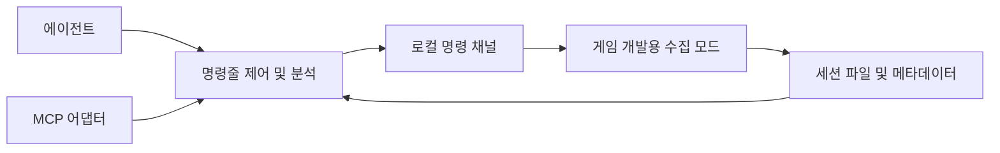

# 에이전트 전용 CPU 프로파일러 제작 검토

작성일: 2026-10-06. 상태: 설계 검토 완료, 구현 전.

## 결론

개발용 수집 모드와 외부 명령줄 분석기를 만드는 것은 가능하다. 우선 선택한 메서드의 호출 횟수, 경과 시간, 호출 관계와 스레드 CPU 지표를 수집하고, 에이전트가 JSON으로 조회·비교하게 한다. 실제 Mono 스택 CPU 샘플링은 별도 실험으로 가능성을 확인한 뒤 추가한다.

GUI 조작, Unity Development Build, dotTrace 결과 뷰어에 의존하지 않는 구조가 목표다. 메모리 분석은 기본 수집 대상에서 제외하고 GC가 CPU와 틱 지연에 끼친 영향만 보조적으로 기록한다. 계측 자체가 게임을 느리게 만드는 정도를 항상 함께 평가한다.

## 확인한 근거와 제한

### 현재 코드

- `Source/Helodrace/Core/RaidCpuProfiler.cs`: 전술 단계별 `Stopwatch.GetTimestamp()` 경과 시간 계측. 하위 작업이 포함되므로 CPU 실행 시간이나 메서드 자체 비용과 동일하지 않다.
- `Source/Helodrace/Core/TacticalCpuSamples.cs`: 최근 최대 2,048개 값에서 백분위 산출. 합계·횟수·최대는 누적값이므로 백분위와 기간이 다르다. 새 출력은 각 통계의 기간을 명시해야 한다.
- 틱 전체 계측은 Harmony Prefix/Postfix 형태다. 예외가 생길 때도 종료가 보장되는 설계가 새 계측에 필요하다.
- `Source/Benchmarks/RaidMovementAudit/Run-GameAudit.ps1`와 런타임 감사 코드를 재사용해 별도 설정 폴더에서 게임을 실행하고 사례별 완료를 확인할 수 있다. 현재 빠른 테스트의 모든 맵 생성 조건이 고정됐다고 가정하지 않는다.

### dotTrace 실험

2026-10-06 설치된 dotTrace CLI 2026.2.3.1과 실행 중인 ETW 서비스로 50명 전술 습격 600틱을 실행했다. 일반 Timeline 연결·수집·저장은 성공했고 데이터는 약 222 MiB였다. Unity 전용 설정은 다음 메시지로 거부됐다.

> Unity profiling is only available for Development Builds.

일반 Timeline 저장 성공은 Mono 메서드 CPU 수집 성공을 뜻하지 않는다. 실험 자료는 `C:/Users/Public/Documents/ESTsoft/CreatorTemp/hd-dottrace-20261006-200644`에 있다.

### 설치된 Mono의 실제 API

게임을 실행하거나 DLL을 로드하지 않고 `MonoBleedingEdge/EmbedRuntime/mono-2.0-bdwgc.dll`의 PE export 테이블을 읽었다. 다음 함수가 존재한다.

- `mono_profiler_create`, `mono_profiler_set_jit_done_callback`
- `mono_profiler_enable_sampling`, `mono_profiler_set_sample_mode`, `mono_profiler_set_sample_hit_callback`
- `mono_profiler_set_call_instrumentation_filter_callback`, `mono_profiler_set_method_enter_callback`, `mono_profiler_set_method_leave_callback`
- `mono_stack_walk_async_safe`, `mono_jit_info_table_find`, `mono_jit_info_get_method`

이는 네이티브 연구를 시작할 근거다. 함수 존재는 정상 작동, ABI 일치, Windows 샘플링 지원을 입증하지 않는다. 일반 Mono 소스는 프로파일러 생성·샘플링 활성화를 관리 코드 실행 전 초기화 단계로 제한한다. 게임 모드의 초기화 시점은 이미 늦을 수 있다. 해당 Unity 포크에서 동일한지, 초기 진입 지점 확보가 가능한지 먼저 검증해야 한다. [Mono 구현](https://raw.githubusercontent.com/mono/mono/main/mono/metadata/profiler.c)

## 수집 방식

| 방식 | 얻는 정보 | 제작 판단 |
|---|---|---|
| 수동 구간 계측 | 전술 단계·작업별 경과 시간, 횟수 | 가장 먼저 기존 코드에 적용 가능 |
| 선택적 Harmony 메서드 계측 | 지정 메서드의 경과 시간, 호출 관계, 예외 횟수 | 개발용 모드로 구현 가능. 패치 가능 여부와 부하 검증 필요 |
| 스레드 CPU 카운터 | 선택 구간에 소비한 해당 스레드 CPU 시간·사이클 | 긴 구간과 집중 계측에 사용. 짧은 메서드에는 정밀도 한계 |
| Mono 네이티브 샘플러 | 주기적 스택과 메서드별 실행 비중 추정 | 초기 로딩·ABI·샘플링 가능성 검증 후 채택 |
| ETW 보조 수집 | 프로세스·스레드 CPU, 실행/대기, 네이티브 병목 | 보조 가능. Mono 메서드 이름 복원은 별도 문제 |

### 경과 시간과 CPU 구분

출력 필드를 명확히 나눈다.

- `elapsedInclusiveMs`: 계측 구간의 경과 시간. 대기와 하위 호출을 포함한다.
- `elapsedTrackedSelfMs`: 동일 스레드에서 계측된 자식 구간을 뺀 경과 시간. 계측하지 않은 자식은 포함된다. 전체 호출 트리의 진정한 self time이라고 표현하지 않는다.
- `threadCpuMs`: 구간 시작·종료의 스레드 user/kernel CPU 카운터 차이. 세밀한 메서드 비교보다 틱·메서드 묶음의 누적 비용 평가에 적합하다.
- `threadCpuCycles`: 스레드 CPU 사이클 카운터 차이. 시간 단위로 변환하지 않고 같은 환경의 반복 비교에 사용한다.
- `cpuSampleCount` / `cpuEstimateMs`: 네이티브 샘플링 검증 후 제공할 필드. 샘플 주기, 실제 클록 종류, 유효 샘플 수와 추정 방법을 함께 출력한다. 벽시계 샘플링만 확인되면 CPU 시간이라고 표시하지 않는다.

`GetThreadTimes`의 100 ns 단위는 짧은 구간을 그 정밀도로 측정할 수 있다는 뜻이 아니다. 단시간 측정이 0이 될 수 있고 API 호출도 비용을 소비한다. 긴 구간·반복 합계로 검증한다. `QueryThreadCycleTime` 사이클을 ms로 환산하면 안 된다. [GetThreadTimes](https://learn.microsoft.com/en-us/windows/win32/api/processthreadsapi/nf-processthreadsapi-getthreadtimes), [QueryThreadCycleTime](https://learn.microsoft.com/en-us/windows/win32/api/realtimeapiset/nf-realtimeapiset-querythreadcycletime)

### 호출 관계와 비동기 작업

스레드별 고정 용량 스택으로 선택 메서드의 부모·자식 관계를 추적한다. 스택을 매번 `StackTrace`로 복원하지 않는다. 중첩·재귀와 정상 종료·예외 종료를 구분하고, 종료 계측은 한 번만 적용한다. 게임 예외의 종류나 전달 흐름을 바꾸지 않는다.

호출 횟수는 실제 계측 대상 진입 횟수이고, 샘플링 비중과 분리한다. 집중 수집을 건너뛴 호출은 별도 집계하고 통계의 표본 범위를 기록한다. 부모·자식을 서로 다른 비율로 계측한 결과에서 self time을 임의 계산하지 않는다.

Task/Unity Job/코루틴 대기 동안의 메인 스레드 경과 시간을 작업 CPU로 계산하지 않는다. 워커 실행은 별도 스레드 구간으로 기록하고 작업 ID로 연결한다. 코루틴은 각 `MoveNext`의 실행 구간을 측정한다. 다른 스레드의 자식 CPU를 부모 스레드 시간에서 빼지 않는다.

## 구성

### 게임 수집 모드

독립적인 개발용 모드가 선택적 Harmony 계측과 제어 채널을 담당한다. Helodrace에는 전술 단계·분대·작업의 문맥을 전달하는 작은 어댑터를 둔다. 일반 사용자의 필수 의존성으로 추가하지 않는다.

메서드는 어셈블리·타입·전체 시그니처로 선택한다. 모호한 오버로드, 패치 불가 메서드, 인라이닝이나 동적 메서드 때문에 가시성이 제한되는 경우를 상태 결과에 남긴다. Harmony 패치 목록과 대상 원본/패치 계측 범위를 기록한다. 다른 모드의 패치가 포함된 비용을 원본 메서드만의 비용으로 표시하지 않는다.

초기에는 `RefreshFrames`, 통신 그래프 계산, 음성 LOS, 무전 장비 검색, 이동 캐시 Pump/큐 관리에 집중한다. 모든 게임 메서드를 한 번에 패치하지 않는다.

### 외부 CLI

첫 구현은 GUI 없이 CLI와 구조화된 파일 입출력을 사용한다. 게임 제어는 로컬 named pipe 또는 파일 큐 중 작은 구현을 선택한다. 메인 스레드는 적은 수의 명령만 주기적으로 처리하고 캡처 종료·응답 지연·게임 종료를 명시적으로 처리한다.

프로파일 저장은 종료된 버퍼나 값 스냅샷을 외부/백그라운드에서 처리한다. 수집 콜백에서 파일 I/O, JSON 직렬화, 정렬을 하지 않는다. 백그라운드 분석이 Pawn/Map/Unity 객체를 읽지 않도록 한다.

초기 CLI의 `--json` 출력만으로 현재 에이전트가 shell 도구를 이용해 제어·분석할 수 있다. 이후 같은 분석 API 위에 stdio MCP 어댑터를 붙인다. MCP 어댑터가 계측 엔진을 다시 구현하지 않게 한다. 연결 설정이 완료되기 전에는 도구가 에이전트에 자동 노출된다고 가정하지 않는다. [MCP 서버 구현 안내](https://modelcontextprotocol.io/docs/develop/build-server)

## 에이전트용 기능

다음은 구현할 명령/API의 제안이며 현재 사용 가능한 명령이 아니다.

| 기능 | 주요 결과 |
|---|---|
| `capabilities` | 런타임·버전·사용 가능한 수집 방식·지원하지 않는 이유 |
| `methods search` | 시그니처, 메서드 ID, 소스 위치, 패치 가능 여부 |
| `capture start/status/stop` | 세션 ID, 수집 모드, 표본 수, 종료 이유, 데이터 유실 |
| `hotspots` | 비용 상위 N개, 호출 횟수, 대상 기간과 측정 종류 |
| `callers/callees` | 지정 메서드의 계측된 호출 관계와 문맥 |
| `timeline` | 틱·프레임·습격 단계·오류 이벤트별 제한된 구간 |
| `compare` | 변경 전후 비용 차이, 기준 조건 일치 여부, 표본 부족 |
| `audit run` | 격리된 게임 테스트 실행, 캡처 연결, 완료·실패 확인 |
| `export` | JSON/CSV, 제한된 이벤트 trace, 검증된 샘플 스택의 flame graph 자료 |

대용량 trace 전체를 에이전트 문맥에 넣지 않는다. 기본 조회는 상위 25개, 기간·스레드·맵·분대·메서드 필터와 페이지네이션을 제공한다. 항상 원본 세션 경로와 조회 조건을 반환한다. MCP 도구도 같은 제한을 적용한다.

세션 메타데이터에는 게임·Mono 버전, DLL SHA와 커밋, 활성 모드, 대상 메서드 목록, 맵/세이브/시나리오 식별자, 폰·분대 수, 속도, 워밍업, 실제 측정 틱·프레임·시간, 계측 모드를 저장한다. 메서드의 어셈블리 MVID·token은 세션 내 식별에 사용하고 변경 전후 대응은 전체 시그니처와 빌드 정보를 이용한다.

정상 게임 진행과 CPU 개선을 함께 확인하도록 이동 성공, 명령 지연, 습격 진행, 예외 수를 기존 감사 결과와 연결한다. 동작을 덜 수행해 빨라진 변경을 성능 개선으로 잘못 판단하지 않도록 한다.

## 수집 비용 통제

- 기본 상태는 수집 비활성화다. 수집 모드를 설치하지 않은 정상 게임에 추가적인 계측 의존성을 만들지 않는다.
- 초기 경량 모드는 전술 큰 구간, 집중 모드는 소수 메서드에 적용한다. OS CPU 카운터를 모든 짧은 호출에서 읽지 않는다.
- 메서드별 문자열, Reflection, 딕셔너리 등록은 준비 단계에서 끝내고 수집 경로에서는 정수 ID와 사전 할당된 스레드별 버퍼를 사용한다.
- 캡처 시간, 메서드 수, 스택 깊이, 이벤트 용량에 상한을 둔다. 포화되면 게임을 기다리게 하지 않고 버린 수와 불완전 상태를 기록한다.
- 상시 원시 호출 이벤트 저장 대신 합계·횟수·히스토그램을 기본으로 하고 상세 이벤트는 짧은 캡처에서만 켠다.
- 세션 종료·연결 단절·시간 만료 시 수집을 중단한다. 패치 설치/해제는 실행 중인 수집 구간과 분리하고 비활성 상태의 잔여 부하도 측정한다.
- 버퍼 정렬·보고서 생성은 수집 종료 후 수행한다. 기존 최근 표본과 누적 합계의 기간 혼합을 없앤다.

계측 오버헤드 목표는 경량 모드 2% 이내, 집중 모드 5% 이내로 두되 보장값이 아니다. 같은 조건에서 실제 측정해 넘으면 대상 축소·수집 빈도 조절을 한다. 평균 외에 틱 p95/p99 악화도 확인한다. 측정값에서 추정한 오버헤드를 일괄 빼서 정확한 CPU 시간처럼 표시하지 않는다.

## 구현 순서와 통과 기준

### 1. 메트릭과 에이전트 분석 기반

기존 경과 시간 계측을 구조화된 세션 데이터로 내보내고 `capabilities`, `hotspots`, `compare` CLI를 만든다. 출력에서 경과 시간과 CPU를 명확히 구분한다. 고정된 테스트 조건, 수집 비활성 기준 실행, 틱/프레임/초당 정규화를 확보한다.

통과 기준: 에이전트가 GUI 없이 사례 실행·결과 조회·비교를 끝낼 수 있고, 비용 필드의 의미와 기간이 일치한다. 레이드 종료 후 틱이 없거나 멈춘 상태는 ms/tick으로 나누지 않고 ms/초·ms/frame을 사용한다.

### 2. 선택 메서드 계측과 스레드 CPU

개발용 모드에서 지정 메서드를 계측하고 중첩·예외·재귀·워커를 처리한다. 통신과 이동 캐시부터 실제 메서드별 원인을 분해한다. 긴 구간의 `GetThreadTimes`와 집중 대상의 사이클 계측을 추가한다.

통과 기준: CPU 계산 루프·Sleep 대기·중첩·예외·별도 워커 사례에서 예상한 지표가 나온다. 잔여 패치 부하, 수집 중 부하, 연결 단절과 종료를 실제 Mono 게임에서 확인한다. 분석 중 게임 객체를 읽지 않는다.

### 3. 네이티브 Mono 샘플링 가능성 실험

독립 테스트 실행에서 ABI와 초기 로딩 경로를 먼저 확인한다. JIT 주소/메서드 매핑과 Windows 스택 샘플이 실용적으로 연결되는지 검증한다. 이 단계는 단순 C# 모드 추가만으로 가능한 것으로 가정하지 않는다.

샘플링 콜백은 네이티브 버퍼에 최소 데이터만 기록한다. Mono 관리 코드, Unity API, 잠금이 필요한 분석, 이름 문자열 해석을 콜백 안에서 수행하지 않는다. 해석은 수집한 JIT·메서드 메타데이터로 나중에 한다.

통과 기준: 계산 루프와 대기를 구분하고, JIT/Harmony 동적 메서드의 이름 복원율과 미확인 비중을 보고한다. 실제 샘플 모드의 클록과 스레드 실행 비중을 검증한다. 충분히 낮은 부하와 안정성이 입증되면 채택한다. 초기화나 스택 복원이 불가능하면 1~2단계 도구를 유지하고 CPU 샘플링을 지원하지 않는다고 명시한다.

### 4. MCP와 반복 비교

검증된 CLI API를 MCP 도구로 노출하고 0/40~50/100/200명, 습격 중·종료 후 사례를 반복 비교한다. 처음부터 MCP가 필수인 구조를 만들지 않는다.

통과 기준: 에이전트가 범위를 좁힌 수집, 상위 메서드 조사, 수정 전후 비교를 재현할 수 있다. 런타임이나 빌드가 바뀌면 네이티브 기능을 다시 검증하고 지원 범위를 갱신한다.

## 권장 첫 범위

1~2단계를 먼저 만든다. 현재 병목으로 보고된 `communications:RefreshFrames`와 `raidmovementareas`의 호출 횟수·누적 경과 시간·큰 구간의 스레드 CPU를 분리하면 바로 최적화 판단에 사용할 수 있다. GUI 없는 제어와 구조화된 결과를 처음부터 제공하고, 실제 샘플링은 초기 로딩 실험의 성공 여부에 따라 추가한다.

Dubs Performance Analyzer와 RimDoctor의 실제 소스도 검토했다. RimDoctor의 타임스탬프·주기 집계 구조와 Dubs의 선택적 내부 호출 분해 방식을 참고하되, 예외 종료·재귀·스레드 상태·조회 스냅샷은 독립적으로 설계한다. 세부 근거와 재사용 범위는 [Dubs 및 RimDoctor 프로파일링 참고 검토](Dubs%20및%20RimDoctor%20프로파일링%20참고%20검토.md)에 정리했다.

이번 검토에서는 게임 코드와 프로파일러를 구현하거나 네이티브 콜백을 실행하지 않았다. Mono DLL의 export 존재 확인까지 완료했고, 그 API의 실행 가능성은 아직 검증하지 않았다.

## 구현 및 실제 수집 후속

선택 계측 수집기와 CLI를 구현하고 실제 게임의 경량·상세·비활성 대조 수집을 마쳤다. 세부 메서드는 경과 시간, 실제 스레드 CPU는 전체 게임 틱에 한정한다. 기본값을 경량 모드로 정했으며 네이티브 샘플러·MCP·독립 모드 패키지는 후속 범위다. 결과와 다음 최적화 순서는 [에이전트 프로파일러 구현 결과와 다음 최적화 계획](에이전트%20프로파일러%20구현%20결과와%20다음%20최적화%20계획.md)을 참고한다.
