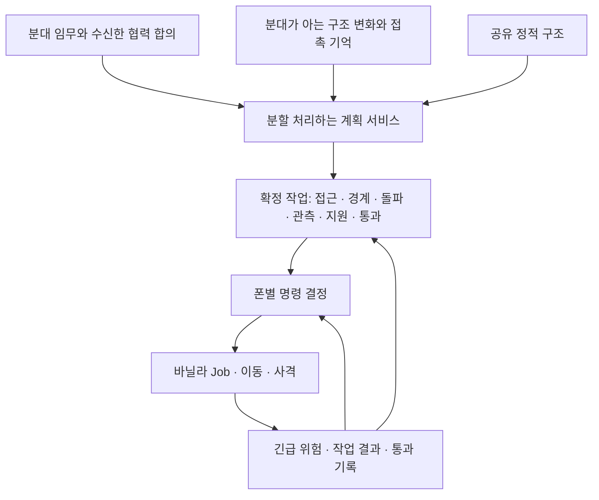

# 전술 AI 구조 개편 검토

작성: 2026-10-05. 검토 기준: `main`의 `7b299f67`과 현재 작업 트리의 전술 소스. 구조 변경에 따른 행동 차이는 허용하되 기존 의도와 방향성을 유지한다는 사용자 요청을 반영했다. 이 문서는 개편 제안이며 구현 완료 기록이 아니다.

추가 기준: 같은 날 사용자가 **틱 지연 최소화를 가장 중요한 개선으로 지정했으며, 이를 위한 전술적 정확도 저하와 일부 부자연스러운 행동을 허용했다.** 아래 성능 우선 기준과 수정한 구현 순서를 먼저 적용한다.

## 결론

**계획 생성과 실행·이동의 결합을 풀고, 분대 임무 아래 역할별 작업과 폰별 명령을 두는 구조로 개편하는 것을 권장한다.** 현재 단계 상태에 예외를 계속 추가하는 방식보다 Security의 다른 이동 요구, 늦은 합류, 야전 전환, 다중 진입을 표현하기 좋다.

**첫 목표는 전체 계산량과 가장 긴 틱의 비용을 줄이는 것이다.** 후보 탐색·관측·재평가를 먼저 줄이고, 남는 무거운 계산을 분할하며, 대기/이동 분대의 반복 실행을 제거한다. 역할별 작업과 이동 구조 교체는 실제 반복 계산이나 정지를 줄이는 범위부터 진행한다. 정적 구조 분석, 관측·통신 정책, 바닐라 이동·사격 실행, Native 배열 수명 관리는 재사용할 기반이다.

기존 [8단계 통합 계획](분대%20협력%20진입과%20야전%20전술%20통합%20계획.md)의 목표와 순서는 유지한다. 아래 A~E는 그 계획의 4단계 이후를 안정적으로 진행하기 위한 기반 개편 순서다. 기존 1~3단계를 미구현으로 되돌리거나 새 8단계 계획으로 교체하지 않는다.

## 0. 성능 우선 기준

우선순위는 **틱/프레임 처리 비용 감소 → 진행 가능한 최소 동작과 기존 방향 유지 → 전술 정밀도 → 행동의 자연스러움**이다. 전술 정밀도와 자연스러움 때문에 비싼 반복 검사를 남기지 않는다. 이 기준은 아래의 정확한 배치·연속 이동·판단 빈도에 관한 제안보다 우선한다.

여러 프레임으로 같은 계산을 나누는 것만으로는 총 CPU 비용과 지속적인 TPS 저하가 해결되지 않는다. **계산을 덜 하는 것과 한 번에 오래 계산하지 않는 것을 함께 적용한다.** 일반 판단이 늦어지거나 폰이 짧게 멈추는 것은 허용하지만, 완료할 수 없는 대기와 무한 재시도는 허용하지 않는다.

### 우선 줄일 계산

| 항목 | 성능 우선 방식 | 감수할 변화 |
| --- | --- | --- |
| 진입점 선정 | 가까운 유효 벽/문 후보를 제한된 수만 검사하고, 기본 접근·작업 공간·통과 조건을 만족하는 첫 후보 채택 | 더 좋은 진입점이 있어도 덜 좋은 지점 사용 |
| 다음 방 | 알려진 인접 연결과 미확인 방을 일정한 순서로 처리. 이미 유효한 연결은 유지하고 방마다 전체 후보 비교를 반복하지 않음 | 방 정리 순서와 이동 거리가 덜 효율적일 수 있음 |
| 스택/경계 자리 | 사전 생성한 소수의 연결된 자리에서 선택. 가장 좋은 엄폐/감시각을 찾는 확장 탐색은 생략 | 대형이 덜 예쁘고 일부 방향의 감시가 덜 촘촘함 |
| 이동 보정 | 공통 구간과 통로 조건 재사용. 실제 실패·필수 통과·큰 이탈에만 갱신 | 약간의 산개, 늦은 방향 수정, 지향점에서 짧은 멈춤 |
| 적 관측 | 일반 관측은 소수 인원을 순환시키고 후보/LOS 횟수를 제한. 직접 피격·근접 위험은 해당 인원의 기존 반응으로 처리 | 먼 적 발견과 분대의 자세한 대응이 늦어질 수 있음 |
| 대기/정지 분대 | 명령을 유지하고 작업 공간 해제·위험·보고·실제 실패 때 깨움. 일반 폴링은 더 낮은 빈도로 분산 | 해제 뒤 출발에 약간의 지연 |
| 재계획 | 작은 점수 변화·문 상태 재검사로 다시 계산하지 않음. 실패 결과도 입력/지역 변경 또는 재시도 시각까지 재사용 | 낡은 계획을 더 오래 사용하고 최선의 대응을 놓칠 수 있음 |
| 정적/국소 지도 | 정적 연결 재사용, 현재 작업 구역만 제한적으로 검증. 전체 지역 배열 갱신도 필요할 때 수행 | 관측한 변화가 일반 계획에 반영되기까지 지연 |

위의 후보 수·관측 인원·갱신 간격은 조정값으로 두고 실게임 측정으로 확정한다. 첫 유효 후보는 가장 싼 기본 조건을 통과한 후보를 뜻하며, 막힌 통로나 벽 너머 자리를 유효하다고 처리하는 것은 아니다.

### 계산 한도와 실패 처리

- 후보 검사 수, 탐색 확장 수, LOS 수, 재시도 횟수에 각각 한도를 둔다. 실패 후보가 많아도 그 틱에 나머지를 끝까지 검사하지 않는다.
- 한도 내 결과가 없으면 이전의 유효한 명령 유지, 이미 알려진 연결의 단순 이동, 현재 공간 대기 중 하나를 선택한다. 전체 탐색을 즉시 다시 시작하는 fallback은 사용하지 않는다.
- 첫 계획과 다음 방 계획도 비싼 일반 계획 전체를 필수로 거치지 않는 간단한 경로를 둔다. 단순안이 유효하면 더 정교한 계산을 생략한다.
- 명령 종류·도착 구역·필수 통로가 그대로이면 목적지의 작은 개선을 위해 Job과 경로를 다시 만들지 않는다. 공유 자료로 대체할 수 있는 폰별 조회·할당·연결 탐색을 제거한다.
- 긴급 대응도 해당 폰/작업의 가까운 소수 후보로 처리한다. 긴급이라는 이유로 모든 분대 재계획이나 무제한 안전 자리 탐색을 시작하지 않는다.

유지할 최소 조건은 실제 통행 가능성, 선택 개구부 사용, 정지 자리 중복과 벽 너머 배치 방지, 기존 폭발/투척 안전, 정보 공유 제한, 무한 정지 방지다. 이 조건들도 저렴한 지역 검사와 기록된 상태를 사용한다. 명령 안정성이 확보돼 있으면 전술의 재최적화는 미룬다.

### 성능 평가를 먼저 수행

평균 TPS와 함께 실제 Tick 시간의 p95/p99/최댓값, 전체 프레임 시간, 전술 CPU 총량, GC/할당, 바닐라 경로 요청 수를 측정한다. 메인 스레드 작업을 Update나 워커로 옮겼다는 이유만으로 개선으로 판정하지 않는다. 전체 게임 처리 비용이 줄고 지속 TPS가 유지되거나 향상돼야 한다. 진단 기록 자체의 비용도 확인한다.

일반 관측·합류·대기 해제의 지연 증가는 측정해 보고하되 단독 실패 조건으로 삼지 않는다. 단순 행동으로 성능이 좋아지고 임무가 끝까지 진행된다면 채택할 수 있다. 비용이 줄지 않는 정교한 구조 변경은 추가하지 않고, 위험한 진입이나 영구 정지는 별도 결함으로 처리한다.

## 1. 유지할 의도와 바꿀 수 있는 동작

| 유지할 기준 | 개편에서의 처리 |
| --- | --- |
| 선택한 외벽/문을 직접 돌파하고 열린 위험 통로로 새지 않음 | 돌파점과 접근 연결을 확정한다. 외부의 은엄폐 우회와 마지막 직접 접근을 구분한다. |
| 이동 노드는 분대 공통 지향점 | 중간 노드의 정확한 개인 자리·전원 도착 대기를 없애고 실제 집결과 통과를 구분한다. |
| 시작 구조를 오래 재사용 | 정적 방/벽/문 구조는 고정 버전으로 공유한다. 변화는 작은 지역의 관측 지식으로 덧붙인다. |
| 시야 밖 적·문 변화에 전술적으로 반응하지 않음 | 실제 물리 상태와 단위 지식을 분리한다. 물리 이벤트가 발생했다는 이유만으로 관측 기록을 만들지 않는다. |
| LOW는 접촉·보고, High는 장비 기반 무전 | 정보와 합의의 전달 조건을 보존한다. High 무전은 방탄복 무전기 파츠 조건을 사용하며 임시 태블릿으로 대체하지 않는다. |
| 연결된 스택, 고유한 정지 칸, 개구부 옆 관측 | 배치 작업의 명시적 조건으로 유지한다. 문/구멍 자체에 정지 자리를 배정하지 않는다. |
| 관측→지원 판단→효과 대기→진입 | 실제 투척물·폭발물 상태와 투척자 복귀를 안전 조건으로 유지한다. 계산 예산이나 단계 변경으로 생략하지 않는다. |
| 목표 침대 확보 뒤 남은 방 확인 | 최종 임무와 현재 방 작업을 분리한다. 확인 기록이 영구적인 적 부재를 뜻하지 않게 한다. 지정 목표도 유지한다. |
| 공병 상실·장비 회수·지휘 승계 | 담당자만 교체하고 이미 열린 통로와 진행 중인 폭발물 상태를 유지한다. |
| 향후 야전과 교리별 운용 | 같은 명령·이동 실행기를 사용한다. LOW 임시 대응조, High 13인 분대의 3개 화력조, 활처럼 휘어진 사격 대형을 지원한다. |

허용할 행동 차이는 중간 지향점 수, 이동 중 폰 간 간격, 입구 통과 순서, 안전한 후보 사이의 선택, 일반 판단의 완료 시점이다. 정확히 같은 칸·같은 틱·같은 경로를 재현하는 것은 목표가 아니다. 성능을 위해 짧은 정지와 다소 어색한 방향 수정도 허용한다. 영구 정지·반복 왕복, 폭발 전 돌입, 벽 너머 대형, 관측 없는 계획 변경은 막는다. 이동 중의 일시적인 겹침과 정지 대형의 자리 중복도 구분한다.

킬존 감지와 전략적 중요도 맵은 복원하지 않는다. 위험 대응은 구조적 차폐 후보와 관측·보고된 사격 방향에서 나온다. 모든 적·아군의 실제 상태를 읽는 전역 지휘 AI도 도입하지 않는다.

## 2. 코드와 측정에서 확인한 개편 근거

최근 Security 정지 원인과 수정은 [실게임 검증 기록](Security%20이동과%20대규모%20전술%20최적화%20실게임%20검증.md)에 있다. 아래는 그 수정을 취소하자는 제안이 아니라, 비슷한 충돌을 반복해서 만들기 쉬운 구조에 대한 검토다.

| 확인한 구조 | 근거 | 개편 이유 |
| --- | --- | --- |
| 분대 상태 하나에 이동·돌파·투척·야전 대응·개인 경계를 저장 | `RaidTacticalExecution.ExecutionState`, 여러 파일의 동일 partial 실행기 | 파일이 나뉘어도 상태 수명과 진행 조건은 강하게 연결돼 있다. 부분 재계획 때 어떤 상태를 복사·유지할지 계속 늘어난다. |
| 접근 연결의 유효성이 전체 단계에 의존 | `RaidNodeMovement.ConnectionFor`: Assemble이며 ApproachComplete가 아닐 때만 연결 반환 | 경계 해제나 늦은 합류를 표현하려면 개인 이동을 위해 분대 접근 상태를 다시 열어야 하는 경우가 생긴다. |
| 요청 명령이 발행 과정에서 다시 바뀜 | `RaidTacticalOrders.SetMeasured`: 접촉 경계 우선 처리, 외벽 진입 목적지 보정 | 요청 위치와 실제 명령 위치가 다를 수 있다. 차단 사유 표시는 개선됐지만 작업 간 우선순위를 여러 곳에서 해석한다. |
| 비용 선택과 실제 한 칸 진입 검사 모두 존재 | `RaidMovementArea.Select`, `RaidNodeMovement`의 PathFollower 패치 | 서로 다른 상태를 해석하면 바닐라가 선택한 경로를 실행 직전에 거부하고 작업이 실패한다. 두 판단의 공통 입력이 필요하다. |
| 계획 한 번은 끝까지 동기 실행 | `RaidTacticalPlanner.MeasuredPlan/MakePlanCore`, `TacticalWorkBudget` | 현재 3ms 예산은 다음 호출의 입장을 제한한다. 이미 시작한 한 번의 계산은 나누지 못한다. |
| 다음 방 선정에서 여러 완전한 계획을 연속 시도 | `RaidTacticalExecution.TryPlanNextRoom` | 바깥 입장 검사 한 번 뒤 이웃 방·최종 목표·앵커 후보마다 MakePlan을 호출할 수 있다. 각 후보 검사 중에는 양보하지 않는다. |
| 실행 갱신은 공통 10/30틱 시점에 모임 | `RaidTacticalExecution.ExecutionTick/Update` | 공통 시점에 여러 분대의 관측·반응·진행 검사가 몰린다. 공유 개구부 대기 분대도 긴급 반응·관측 등의 경로를 거친다. |
| 가까운 돌파 작업 구역을 하나의 사용권으로 직렬화 | `RaidSharedOpening.WaitForSharedOpening`: 같은 팩션, 12칸 이내 충돌 | 현재 교착을 막는 안전 장치다. 독립 작업 공간과 이미 열린 통로의 통행을 구분하면 향후 병렬 진입을 더 정확히 표현할 수 있다. |

400명 1배속 시험의 전술 실행 p95/p99는 약 55.2/95.4ms였으며, 별도 50명 장시간 시험에서도 계획 한 번 96.9ms, 실행 프레임 최고 174.2ms가 남았다. **남은 문제를 배열 준비 지연 하나로 설명할 수 없다.** 400명 시험 종료 시 389명은 같은 개구부 작업 대기였고, 배열 대기는 종료 시 0건이었다.

이 수치는 해당 시험 조건의 결과다. 모든 분대가 동시에 CQB를 수행하는 성능이나 정확한 병목 비율은 증명하지 않는다. 프로파일 구간은 중첩되므로 시간을 더해 전체 비용으로 해석하지 않는다. 개편의 첫 계측 목표는 한 번의 계획 내부와 대기/이동/작업별 실행 비용을 더 잘 구분하는 것이다.

## 3. 권장 구조

범용 행동 트리 편집기나 매 틱 전체 작업 그래프 탐색기를 만들 필요는 없다. 소수의 명시적인 작업 종류와 의존 조건으로 시작한다.

| 책임 | 가진 상태 | 하지 않을 일 |
| --- | --- | --- |
| 분대 임무 | 최종 목표, 담당 구역, 교리, 수신한 합의/세대 | 매 폰의 임시 이동 칸 결정 |
| 작업 실행 | 접근 구간, 경계 자리, 공병/관측/투척 담당, 준비 조건, 중단·재개 기록 | 다른 작업의 개인 진행을 일괄 초기화 |
| 이동 실행 | 공통 지향점, 사용할 연결, 폰별 다음 통과·합류 상태 | 전역 목표·진입점 재선정 |
| 명령 결정 | 폰당 현재 소유자, 확정 명령과 세대, 긴급 중단 이유 | 서로 다른 Job을 여러 시스템에서 직접 덮어쓰기 |
| 계획 서비스 | 요청 큐, 계산 중간 상태, 사용한 입력 버전, 검증된 결과 | 게임 객체를 워커에서 조회 |
| 통로/작업 공간 관리 | 실제 점유·입장 순서·대기 자리·작업/폭발 제한 | 분대 간 관측·준비 상태의 전술 공유 |

예를 들어 돌입조는 접근을 끝내고, Security는 현재 방의 경계 자리를 유지하며, 공병은 벽을 작업할 수 있다. 관측을 시작할 조건은 필요한 인원의 준비와 개구부 확보이지 모든 역할이 같은 이동 노드 목록을 완료하는 조건이 아니다. 후방 경계가 해제되면 그 인원의 합류 작업을 생성한다. 돌입조의 완료 상태는 다시 열지 않는다.

동시에 실행 가능한 작업을 분리하되 필수 조건은 남긴다. 관측자가 돌아오기 전 지원 작업을 시작할 수 있는지, 투척자가 복귀했는지, 폭발 위험이 해소됐는지는 실제 안전 조건으로 검사한다. 작업 실패는 실패·보류·대체 담당·연결 복구 중 하나로 기록하며 설명 없이 완료 처리하지 않는다.

## 4. 이동과 Security의 구조 변경

### 4.1 공통 이동 구간

분대가 확정할 것은 셀 경로 전체가 아니라 **현재 구간, 앞쪽 지향점, 사용할 방/개구부 연결, 허용 우회 범위**다. 외부에서는 벽을 끼고 접근할 구간과 노출 구간을, 실내에서는 현재 통행 공간과 선택한 출구를 표현한다. 세부 셀 경로는 연결 검증이나 안내 계산에 일시적으로 쓸 수 있다.

폰은 그 구간 안의 서로 다른 임시 목적지를 받아 바닐라 Goto로 이동한다. 유효한 목적지와 이동 작업은 안정적으로 유지하고, 다음 구간으로 이어야 할 때나 지속적인 큰 이탈·통행 실패가 있을 때만 바꾼다. 다음 지향점 갱신을 이유로 매 틱 StartJob을 호출하지 않는다. 연속 이동의 자연스러움을 위해 목적지 미세 보정이나 사전 경로 요청을 반복하지 않으며, 낮은 갱신 빈도에 따른 짧은 멈춤은 허용한다.

개인별로 남길 진행은 필수 통로를 실제로 통과했는지, 어느 구간에서 합류해야 하는지, 최종 자리 준비 여부다. 평범한 중간 지점을 전부 개인별 완료 목록으로 관리하지 않는다. 한 칸 문과 작은 방은 통과 공간이며, 전원이 설 자리 확보를 진행 조건으로 삼지 않는다.

### 4.2 경계 작업과 합류 작업

Security는 먼저 경계 대상 구역·자리·방향을 가진 독립 작업이다. 현재 방의 자리로 갈 인원은 현재 연결 공간 안에서 이동한다. 돌입조가 다음 방으로 이동한다는 이유로 동일한 경유 목록을 받지 않는다.

다른 방으로 이동해야 하는 Security는 별도의 합류 연결을 받는다. 알려진 열린 통로와 이미 확보한 경로에서 합류하고, 이전 단계로 돌아가거나 과거 개인 노드를 재방문하지 않는다. 연결을 모르면 안전한 현재 공간에서 경계하며 관측/보고 또는 국소 복구를 기다린다. 다른 분대의 숨은 통로 지식을 가져오지 않는다.

작업 참여자는 명시적으로 고정하고 사상자·역할 변경 때 수정한다. 경계 중인 인원을 접근 도착 대기에 넣고 동시에 움직이지 못하게 하는 조건은 구조적으로 만들지 않는다. 반대로 실제 지원 안전에 필요한 경계 인원은 해당 작업의 준비 조건으로 남긴다.

### 4.3 비용 배열과 한 칸 검사

이동 구간에서 불변의 통행 조건을 한 번 만들고, 바닐라 비용 배열과 실제 진입 검사가 같은 조건을 참조한다. 일반 차폐 선호는 비용으로, 금지된 문/방 진입은 실제 통과 조건으로 구분한다. 긴급 회피는 별도 명령을 사용하지만 폭발 안전과 물리 통행 가능 검사는 유지한다.

현 바닐라 `IPathGridCustomizer.GetOffsetGrid()`는 맵 인덱스로 사용하는 전체 Native 배열을 반환한다. 국소 지도 배열로 단순 교체하거나 실제 진입 검사만 남기면 해결되는 구조가 아니다. 길찾기가 계속 금지된 길을 골라 매번 중간에 실패할 수 있다.

따라서 공유 비용 배열과 안전한 수명 관리를 먼저 유지한다. 새 이동 구간으로 중복 조건을 줄인 뒤 필요한 경우만 배열을 적용하는 최적화를 검증한다. 배열 제거를 개편의 선행 조건으로 두지 않는다. 경로 요청 취소와 Unity Native 읽기 완료가 다르다는 현재 수명 규칙도 유지한다.

## 5. 돌파 작업과 통로 통행 분리

현재 사용권은 근처 분대의 충돌을 막지만 작업 공간과 통과 공간을 함께 묶는다. 새 구조에서는 두 가지를 구분한다.

- **돌파 작업 공간:** 공병·관측자·투척자 동선, 스택 자리, 설치물과 투척물 안전 영역. 실제 겹치는 작업과 안전 영역을 기준으로 사용권을 부여한다.
- **통로 통행:** 사용할 개구부, 진행 방향, 입구 밖 대기 영역, 너머 확보 공간, 실제 통과 완료. 통로 칸을 대기 목적지로 삼지 않는다.

개구부가 열렸다고 바로 통행을 허가하지 않는다. 효과 대기와 안쪽 도착 공간이 확보돼야 한다. 이후 앞 분대가 다음 방을 작업하더라도 후속 인원은 현재 통로의 안전 조건에 따라 따라올 수 있다. 작업 영역이 겹치면 계속 대기하고, 양방향 통행과 후퇴 인원에는 방향 양보 규칙을 둔다.

폴링으로 모든 대기 분대의 자리 후보를 매번 찾기보다 지속적인 칸/통로 점유 인덱스와 해제 통지를 사용한다. 소유자 사망·작업 취소·통로 차단·정체는 사용권 복구 사건이다. 단순 시간 만료로 살아 있는 폭발 제한을 해제해서는 안 된다.

물리 사용권을 얻었다는 사실로 다른 분대의 방 클리어, 적 위치, 투척 준비 완료를 알려주지 않는다. 연락 없이 서로 다른 진입점의 전술 역할을 분산하는 것도 이 계층의 책임이 아니다. 협력 합의와 경로 배분은 기존 4~5단계가 담당한다.

## 6. 순간 지연을 줄이는 계획 처리

계획 요청을 `입력 수집 → 후보 생성 → 탐색/비교 → 실제 검증 → 결과 확정`으로 나눈다. 이름은 제안이며 각 단계는 계산 상태를 보관하고 다음 프레임에 이어서 처리한다.

1. 메인 스레드에서 현재 구성원·장비·자기 지식의 버전과 필요한 지역 입력을 조금씩 수집한다. 수집 중 변한 입력은 변경 범위만 재검증하거나 새 요청으로 전환한다.
2. 정적 후보는 공유하고, 해당 임무와 지역에서 필요한 소수 후보만 선택한다. 값싼 기본 조건을 만족하는 첫 후보를 채택하는 단순안을 우선한다. 다음 방 후보마다 처음부터 전체 계획을 반복하지 않고 같은 요청 안에서 진행을 이어 간다. 더 나은 점수를 찾기 위해 검사를 계속하지 않는다.
3. 값만으로 처리할 수 있는 방 연결 탐색·후보 점수·연결 영역 계산은 불변 입력으로 수행한다. 탐색도 확장 수/시간 한도를 가지고 양보하거나 기존 제한된 워커 풀에서 실행한다.
4. 실제 Standable·예약·작업자·사격/투척 안전은 메인 스레드에서 소수 후보씩 검증한다. 계획 단계의 적 관측도 기존 사격 LOS·연막 관측 서비스로 통일한다. 별도 직접 LOS 경로가 정책을 우회하지 않게 한다.
5. 사용한 임무·지식·담당자·통행 조건의 세대를 확인한 뒤 결과를 한 번에 확정한다. 낡은 워커 결과는 버리고 최신 명령에 덮어쓰지 않는다.

계산 중에도 기존의 유효한 작업과 명령은 계속한다. 첫 계획이 없으면 알려진 안전 공간에서 대기·경계한다. 실제 위험이나 선택 통로 차단으로 기존 명령이 무효가 되면 먼저 안전하게 보류하고 계산 결과를 기다린다. 작은 후보 점수 변화는 현재 작업을 취소하는 이유가 아니다.

일반적인 이동으로 시작 좌표가 한 칸 바뀔 때마다 요청을 취소하지 않는다. 현재 연결 구역에서 새 계획의 시작으로 합류 가능한지 검증하고, 필수 담당 상실·선택 통로 무효·임무 변경처럼 결과를 쓸 수 없는 변경만 취소 조건으로 삼는다. 그렇지 않으면 분할 처리하는 동안 폰이 움직여 계산이 영원히 완료되지 않을 수 있다. 후보 수와 재시도에도 한도를 두고 실패 원인과 지역 대기/대체 결과를 반환한다. 계산은 프레임에 분산할 수 있지만 Job 발행과 전술 상태 확정은 게임 틱 경계에서 수행하며 일시정지 중 진행시키지 않는다.

**프레임 예산은 실제 계산 조각에 적용해야 한다.** 초기 조정 기준은 무거운 전술 계산의 게임 전체 프레임당 약 2~3ms이며 보장된 상한이 아니다. 맵별 공정한 몫을 두되 여러 맵이 각각 예산을 전부 사용해 합계가 늘어나는 방식은 피한다. 단일 바닐라 CanReach/LOS 호출 자체는 중간에 끊지 못한다. 큰 호출을 값 기반 연결 검사로 줄이고 최종 검증에 제한적으로 사용하면서, 조각별 최고 비용과 예산 초과 호출을 기록해야 한다.

현재 값 워커 최대 2개를 출발점으로 삼는다. 새 탐색 워커도 그 공통 자원을 사용하고 작업 종류별 공정성과 이동 배열 준비 우선권을 명시한다. 정적 구조 작업이 다른 모든 계산을 막지 않도록 한다. CPU 코어 수만큼 무제한 Task를 만들거나 폰/LOS/Job 처리를 워커로 옮기지 않는다. 워커 4개 또는 Jobs/Burst 이전은 실제 Unity 경로 Jobs와 경쟁하는 반복 측정 이후 결정한다.

## 7. 실행 갱신과 위험 대응

정기 실행을 모두 같은 10/30틱에 모으는 대신 다음 갱신 시각과 이유를 가진 큐로 분산한다. 분대 구성 조회·물리 자료·목적지 점유 자료는 공유 서비스에서 재사용하고, 변하지 않은 대기 자리를 재선정하지 않는다.

| 종류 | 갱신 계기 | 처리 원칙 |
| --- | --- | --- |
| 폭발/즉각 위험, 다운·사망 | 기존 위험 검사와 직접 사건 | 일반 계획 예산과 분리. 해당 폰/작업을 우선 갱신하며 관측 불가능한 원격 사건을 전술 보고로 만들지 않음 |
| 이동·통과 | 실제 구역/필수 칸 진입, 목적지 근접, 이동 실패, 안전 폴링 | 폰의 현재 위치를 확인하고 다음 유효 구간으로 연결 |
| 사용권/역할 | 공간 해제, 담당 상실, 장비 회수, 역할 반환 | 영향 있는 대기자·작업만 깨움 |
| 관측·통신 | 관측자 순환, 보고 도착, 연막/LOS 재확인 | 기존 공정한 예산과 정보 전달 조건 유지 |
| 국소 계획 | 관측한 차단/통로 변화, 임무 변경, 실제 지속 정체 | 영향 구간만 복구하고 완료한 다른 작업 보존 |

모든 상황을 이벤트로 바꾸지는 않는다. 누락 가능한 변화·문 애니메이션·연막·실제 이동에는 제한된 안전 폴링이 필요하다. 물리 청크 변경 알림은 자료를 오래된 것으로 표시하거나 관측 재검사 후보를 만들 수 있지만, 보이지 않는 문 열림을 분대 지식과 새 진입점으로 즉시 반영하지 않는다.

폰별 명령 결정은 긴급 위험을 우선하고, 나머지는 현재 작업이 가진 소유권과 명시적 중단 조건으로 결정한다. 경계가 영원히 이동보다 우선하는 고정 규칙 대신 경계 작업 해제 후 합류 작업으로 인계한다. 공병·관측·투척처럼 보호할 Job은 작업의 완료/취소와 연결하며, 모든 갱신에서 CheckForJobOverride를 호출하지 않는다.

CQB와 야전은 임무·작업 생성 정책을 달리하고 같은 실행기를 쓴다. 야전에서 접근 중인 적을 보면 이동 작업을 일시 보류하고 엄폐/호형 배치·엄호/기동·계획 연막 작업을 만든다. 교전 해제 뒤에는 기존 임무와 다음 연결로 복귀한다. 별도의 야전 이동 명령 덮어쓰기 체계를 추가하지 않는다.

## 8. 저장과 구형 구조 정리

저장할 것은 최종 임무, 확정 작업과 참여자/담당, 선택 연결과 실제 필수 통과 기록, 정지 자리, 관측/보고의 출처·원 시각, 방 확인 상태, 협력 합의, 투척물·설치물의 실제 안전 진행이다. 조직이 고정한 정적 버전도 현재처럼 공유 보관한다.

후보 탐색 큐, 계산 중간 배열, Native 비용 배열, 캐시 조회 인덱스는 파생 자료로 보고 로드 시 다시 만든다. 비동기 계획 요청은 저장한 임무와 지식으로 재발행한다. 복원 중에는 기존 전술 소유권과 안전한 대기를 유지하고, 실제 폰·장비·투척물·예약을 확인한 뒤 실행을 재개한다. 로드 시각으로 접촉 기억의 수명을 연장하지 않는다.

완료된 개편 부분의 이전 실행 경로는 제거한다. 구형 분대 단계/개인 노드 경로를 새 작업 구조와 동시에 계속 실행하거나 호환 플래그로 영구 유지하지 않는다. 다만 바닐라에 필요한 자료 생성과 Native 수명 관리까지 제거 대상으로 묶지 않는다. 이전 저장 형식/API 호환은 요구하지 않는다.

## 9. 구현 순서와 완료 기준

| 순서 | 변경 범위 | 해당 부분의 완료 기준 |
| --- | --- | --- |
| A. 계산량 축소 | 계획 내부 계측, 첫 유효 후보 채택, 후보/탐색 한도, 단순한 다음 방 선택, 실패 결과 재사용 | 틱 비용과 전술 CPU 총량 감소. 임무 진행과 최소 통행/안전 조건 유지. 더 좋은 전술 후보는 요구하지 않음 |
| B. 계획 서비스 | 모든 운영 MakePlan 호출을 요청 서비스로 통합하고 남은 무거운 후보·탐색·검증을 분할 처리 | 첫 계획·다음 방·정체 복구가 같은 예산/공정성을 사용. 낡은 결과 폐기, 대기 중 기존 명령 유지. 단일 큰 호출의 남은 초과 비용을 측정 |
| C. 실행 비용 축소 | 대기/이동/작업별 낮은 빈도 갱신, 분산 큐, 소수 관측자, 사용권/점유 지속 인덱스 | 대기 분대 수 증가가 매번 전체 후보 재탐색으로 이어지지 않음. CPU 총량과 가장 긴 틱 비용 감소, 사건 처리의 영구 기아 없음 |
| D. 작업·명령·이동 통합 | 반복 조회와 예외 보정을 제거하는 범위에서 역할 작업, 명령 소유권, 공통 이동 구간과 통로 관리로 교체 | Security 합류가 다른 인원의 진행을 초기화하지 않음. 비용과 실제 통과 판정 일치, 개구부 왕복/영구 정지 방지. 구조 교체 전후 CPU 비교 |
| E. 통합 확인 | 저장/로드, 개발자 표시, 기존/확장 시나리오 실게임 검증, 남은 구형 경로 삭제 | 최종 목표·정보 소유권·안전·성능 결과를 함께 확인한 뒤 기존 4단계 협력 합의 진행 |

각 부분은 main에서 검증 후 의미 있는 단위로 커밋한다. 먼저 폴더/클래스 이름만 나누는 리팩토링보다 A~C의 실제 계산량·순간 비용 감소에 집중한다. D도 작은 책임 이전 단위로 진행하고 범용 실행 프레임워크를 만드는 데 비용을 쓰지 않는다. 한 번에 전 파일을 교체하는 방식은 문제 원인과 행동 차이를 구분하기 어려우므로 피한다.

### 검증에 추가할 항목

- 기존 5개 Security 실게임 회귀: 알려진 문, 관측한 새 구멍, 숨은 반대편 문 개폐, 경계 해제 후 늦은 합류, HC 연막 중 통과.
- Security가 현재 방에 남는 경우와 다음 방에 합류하는 경우를 구분한다. 선두가 이미 통과한 뒤 후미만 복구해도 선두가 돌아오지 않아야 한다.
- 막힌 임시 목적지, 한 칸 통로, 작은 방, 양방향 후퇴, 같은 입구 여러 분대, 서로 독립된 입구 여러 분대를 시험한다.
- 공병/관측자/투척자 상실과 교전·회피 중단 뒤 복귀, 실제 폭발 전 진입 금지, 정지 자리 중복 방지, 벽 너머 스택 금지를 확인한다.
- 계산 중 구성원·장비·관측 지식 변화, 맵 제거, 저장/로드에서 오래된 결과나 Native 읽기 중 해제가 발생하지 않아야 한다.
- LOW 미접촉 정보 공유 금지와 High 무전 파츠/단절 조건을 확인한다. 물리 통행 양보가 전술 보고를 만들어서는 안 된다.
- 50/100/200/400명은 같은 입구 대기 시험과 여러 입구에서 실제로 작업하는 시험을 나눠 측정한다. LOW 편제와 High 실제 13인 분대도 각각 사용한다.
- 각 조건은 실행 순서를 바꿔 최소 3회 반복하고 초기 준비·지속 교전·폰 제거 후 유휴 상태를 구분한다. TPS/FPS뿐 아니라 전체 프레임, 계산 조각 최고값, GC/할당, 경로 요청, 명령 교체와 대기 나이를 기록한다.
- 이동 지연은 시작된 Goto만 집계하지 않는다. 아직 시작하지 못한 요청과 의도적인 안전/교전 대기를 별도로 집계한다. CPU 감소를 위한 짧은 일반 대기 증가는 허용하며, 영구 정지·계산 대기의 기아·반복 실패와 구분한다.

현재 자료로 개편 후 TPS나 수용 인원을 약속할 수는 없다. 최우선 판단 기준은 실제 틱 지연과 지속 CPU 비용의 감소다. 전술적 비효율·반응 지연·짧은 멈춤은 허용 범위로 기록하고, 임무 진행과 최소 통행·정보 소유권·폭발 안전 조건은 확인한다. 기능별 자동 검증과 실제 게임 이동 검증을 구분해서 기록한다.

## 10. 주요 소스와 설계 기준

- [실행 상태와 단계 전환](../../Source/Helodrace/Core/RaidTacticalExecution.cs), [개인 노드 진행](../../Source/Helodrace/Core/RaidNodeMovement.cs), [접촉 경계 대응](../../Source/Helodrace/Core/RaidCqbContactResponse.cs).
- [폰 명령과 Job 선택](../../Source/Helodrace/Core/RaidTacticalOrders.cs), [외벽 합류](../../Source/Helodrace/Core/RaidExteriorIngress.cs), [공유 돌파 공간](../../Source/Helodrace/Core/RaidSharedOpening.cs).
- [계획 생성](../../Source/Helodrace/Core/RaidTacticalPlanner.cs), [계획 입장 예산](../../Source/Helodrace/Core/RaidPlanningBudget.cs), [국소 CQB 지도/복구](../../Source/Helodrace/Core/RaidCqbLocalMap.cs).
- [이동 비용과 Native 수명](../../Source/Helodrace/Core/RaidMovementArea.cs), [불변 값 워커](../../Source/Helodrace/Core/TacticalGeometry.cs), [물리 캐시와 관측 예산](../../Source/Helodrace/Core/RaidPhysicalMapCache.cs).
- [지향점과 은엄폐 접근 기준](2단계%20수정%20방향%20-%20지향점과%20은엄폐%20접근.md), [바닐라 전투 구조 분석](바닐라%20전투%20구조와%20전술%20AI%20개선안.md), [8단계 통합 계획](분대%20협력%20진입과%20야전%20전술%20통합%20계획.md).
